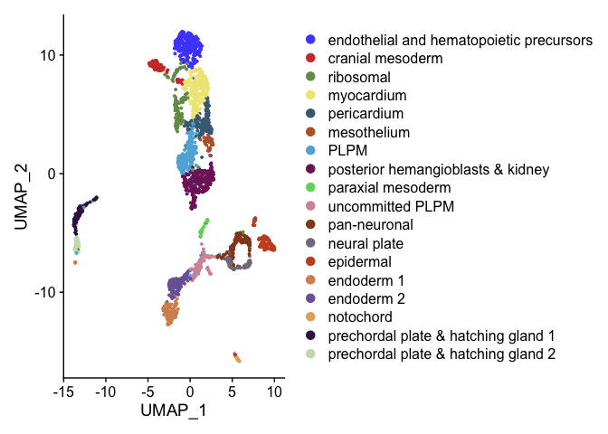

Cluster DE genes R Notebook
================

``` r
library(Seurat)
library(ggplot2)
library(dplyr)
library(ggsci)
library(openxlsx)
options(future.globals.maxSize = 4000 * 1024^2)
```

# read data

``` r
seurat <- readRDS(file = "RDSfiles/hand2.bud.clustered.RDS")
Idents(seurat) <- "sub.cluster"
p <- DimPlot(seurat) + scale_color_igv()
p
```

<!-- -->

``` r
ggsave(filename = "results/hand2_bud_umap.png")
```

    ## Saving 7 x 5 in image

``` r
levels(seurat)
```

    ##  [1] "pericardium"                             
    ##  [2] "mesothelium"                             
    ##  [3] "posterior lateral plate mesoderm"        
    ##  [4] "posterior hemangioblasts & kidney"       
    ##  [5] "endoderm 1"                              
    ##  [6] "epidermal"                               
    ##  [7] "cranial mesoderm"                        
    ##  [8] "pan-neuronal"                            
    ##  [9] "ribosomal"                               
    ## [10] "cardiomyocytes"                          
    ## [11] "prechordal plate & hatching gland 1"     
    ## [12] "endothalial and hematopoietic precursors"
    ## [13] "tailbud"                                 
    ## [14] "notochord"                               
    ## [15] "prechordal plate & hatching gland 2"     
    ## [16] "neural plate"                            
    ## [17] "endoderm 2"                              
    ## [18] "paraxial mesoderm"

``` r
abbreviate(gsub(" ",".",gsub("_",".",levels(seurat))), minlength = 20)
```

    ##                              pericardium 
    ##                            "pericardium" 
    ##                              mesothelium 
    ##                            "mesothelium" 
    ##         posterior.lateral.plate.mesoderm 
    ##                   "pstrr.ltrl.plt.msdrm" 
    ##        posterior.hemangioblasts.&.kidney 
    ##                   "pstrr.hmngblsts.&.kd" 
    ##                               endoderm.1 
    ##                             "endoderm.1" 
    ##                                epidermal 
    ##                              "epidermal" 
    ##                         cranial.mesoderm 
    ##                       "cranial.mesoderm" 
    ##                             pan-neuronal 
    ##                           "pan-neuronal" 
    ##                                ribosomal 
    ##                              "ribosomal" 
    ##                           cardiomyocytes 
    ##                         "cardiomyocytes" 
    ##      prechordal.plate.&.hatching.gland.1 
    ##                   "prchrdl.plt.&.htc..1" 
    ## endothalial.and.hematopoietic.precursors 
    ##                   "endthll.nd.hmtptc.pr" 
    ##                                  tailbud 
    ##                                "tailbud" 
    ##                                notochord 
    ##                              "notochord" 
    ##      prechordal.plate.&.hatching.gland.2 
    ##                   "prchrdl.plt.&.htc..2" 
    ##                             neural.plate 
    ##                           "neural.plate" 
    ##                               endoderm.2 
    ##                             "endoderm.2" 
    ##                        paraxial.mesoderm 
    ##                      "paraxial.mesoderm"

# find all DE genes

``` r
markers <- FindAllMarkers(seurat, only.pos = T, verbose = F)
head(markers)
```

    ##                 p_val avg_log2FC pct.1 pct.2     p_val_adj     cluster    gene
    ## jam2b   1.842710e-131  1.1431834 0.730 0.086 6.698621e-127 pericardium   jam2b
    ## cdh18a  4.131762e-118  0.5230513 0.546 0.045 1.501978e-113 pericardium  cdh18a
    ## col7a1l 4.486469e-105  0.8085230 0.656 0.085 1.630921e-100 pericardium col7a1l
    ## wt1a    4.309043e-101  0.5190972 0.472 0.037  1.566423e-96 pericardium    wt1a
    ## dhrs3a  1.325830e-100  1.1312146 0.785 0.136  4.819656e-96 pericardium  dhrs3a
    ## nr2f1a   1.760259e-97  0.9097332 0.822 0.155  6.398892e-93 pericardium  nr2f1a

``` r
if (!dir.exists("results")){
  dir.create("results")
}
DEgenelist <- list()
for(cluster in levels(seurat)){
  clustername <- abbreviate(gsub(" ",".",gsub("_",".",cluster)), minlength = 20)
  DEgenelist[[clustername]] <- markers[markers$cluster == cluster,]
}
write.xlsx(DEgenelist, file = "results/hand2_bud_cluster_DEgenes.xlsx")
```

``` r
sessionInfo()
```

    ## R version 4.2.3 (2023-03-15)
    ## Platform: aarch64-apple-darwin20 (64-bit)
    ## Running under: macOS Monterey 12.6.2
    ## 
    ## Matrix products: default
    ## BLAS:   /Library/Frameworks/R.framework/Versions/4.2-arm64/Resources/lib/libRblas.0.dylib
    ## LAPACK: /Library/Frameworks/R.framework/Versions/4.2-arm64/Resources/lib/libRlapack.dylib
    ## 
    ## locale:
    ## [1] en_US.UTF-8/en_US.UTF-8/en_US.UTF-8/C/en_US.UTF-8/en_US.UTF-8
    ## 
    ## attached base packages:
    ## [1] stats     graphics  grDevices utils     datasets  methods   base     
    ## 
    ## other attached packages:
    ## [1] openxlsx_4.2.5.2   ggsci_3.0.0        dplyr_1.1.2        ggplot2_3.4.2     
    ## [5] SeuratObject_4.1.3 Seurat_4.3.0.1    
    ## 
    ## loaded via a namespace (and not attached):
    ##   [1] Rtsne_0.16             colorspace_2.1-0       deldir_1.0-6          
    ##   [4] ellipsis_0.3.2         ggridges_0.5.4         rstudioapi_0.14       
    ##   [7] spatstat.data_3.0-1    farver_2.1.1           leiden_0.4.3          
    ##  [10] listenv_0.9.0          ggrepel_0.9.3          fansi_1.0.4           
    ##  [13] codetools_0.2-19       splines_4.2.3          knitr_1.42            
    ##  [16] polyclip_1.10-4        jsonlite_1.8.4         ica_1.0-3             
    ##  [19] cluster_2.1.4          png_0.1-8              uwot_0.1.14           
    ##  [22] shiny_1.7.4            sctransform_0.3.5      spatstat.sparse_3.0-1 
    ##  [25] compiler_4.2.3         httr_1.4.6             Matrix_1.6-1.1        
    ##  [28] fastmap_1.1.1          lazyeval_0.2.2         limma_3.54.2          
    ##  [31] cli_3.6.1              later_1.3.1            htmltools_0.5.5       
    ##  [34] tools_4.2.3            igraph_1.4.2           gtable_0.3.3          
    ##  [37] glue_1.6.2             RANN_2.6.1             reshape2_1.4.4        
    ##  [40] Rcpp_1.0.10            scattermore_1.0        vctrs_0.6.2           
    ##  [43] spatstat.explore_3.1-0 nlme_3.1-162           progressr_0.13.0      
    ##  [46] lmtest_0.9-40          spatstat.random_3.1-4  xfun_0.39             
    ##  [49] stringr_1.5.0          globals_0.16.2         mime_0.12             
    ##  [52] miniUI_0.1.1.1         lifecycle_1.0.3        irlba_2.3.5.1         
    ##  [55] goftest_1.2-3          future_1.32.0          MASS_7.3-60           
    ##  [58] zoo_1.8-12             scales_1.2.1           ragg_1.2.5            
    ##  [61] promises_1.2.0.1       spatstat.utils_3.0-2   parallel_4.2.3        
    ##  [64] RColorBrewer_1.1-3     yaml_2.3.7             reticulate_1.28       
    ##  [67] pbapply_1.7-0          gridExtra_2.3          stringi_1.7.12        
    ##  [70] highr_0.10             zip_2.3.0              systemfonts_1.0.4     
    ##  [73] rlang_1.1.1            pkgconfig_2.0.3        matrixStats_0.63.0    
    ##  [76] evaluate_0.21          lattice_0.21-8         ROCR_1.0-11           
    ##  [79] purrr_1.0.1            tensor_1.5             labeling_0.4.2        
    ##  [82] patchwork_1.1.2        htmlwidgets_1.6.2      cowplot_1.1.1         
    ##  [85] tidyselect_1.2.0       parallelly_1.35.0      RcppAnnoy_0.0.20      
    ##  [88] plyr_1.8.8             magrittr_2.0.3         R6_2.5.1              
    ##  [91] generics_0.1.3         pillar_1.9.0           withr_2.5.0           
    ##  [94] fitdistrplus_1.1-11    survival_3.5-5         abind_1.4-5           
    ##  [97] sp_1.6-0               tibble_3.2.1           future.apply_1.10.0   
    ## [100] KernSmooth_2.23-21     utf8_1.2.3             spatstat.geom_3.1-0   
    ## [103] plotly_4.10.1          rmarkdown_2.21         grid_4.2.3            
    ## [106] data.table_1.14.8      digest_0.6.31          xtable_1.8-4          
    ## [109] tidyr_1.3.0            httpuv_1.6.9           textshaping_0.3.6     
    ## [112] munsell_0.5.0          viridisLite_0.4.2
