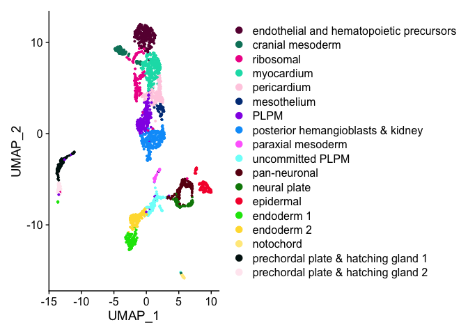
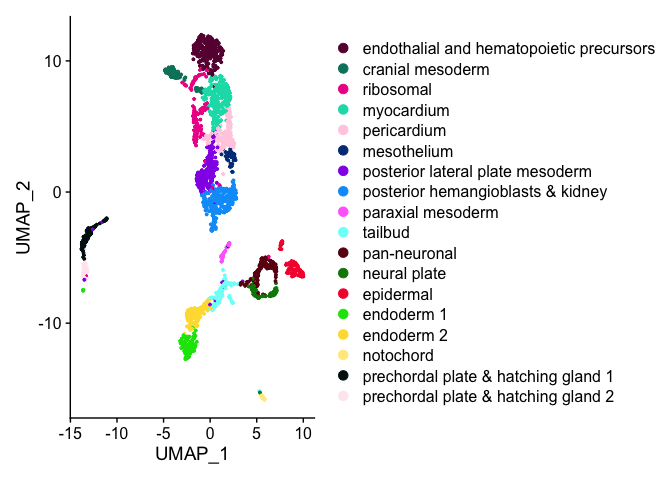
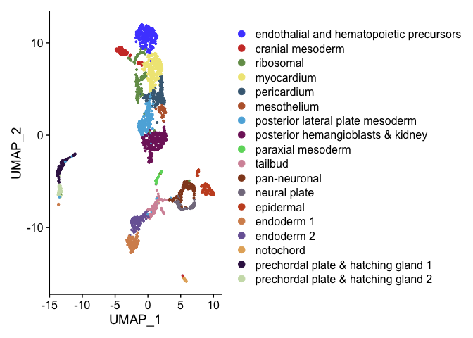
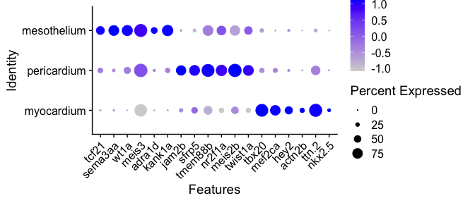

Process hand2 bud stage scRNA-seq R Notebook
================

``` r
library(Seurat)
library(sctransform)
library(ggplot2)
library(dplyr)
library(ggsci)
library(cowplot)
library(patchwork)
options(future.globals.maxSize = 4000 * 1024^2)
```

``` r
mypal <- pal_ucscgb(palette = "default",alpha = 1)(25)
cbpal18 <- c("#68023F","#008169","#EF0096","#00DCB5","#FFCFE2",
           "#003C86","#9400E6","#009FFA","#FF71FD","#7CFFFA",
           "#6A0213","#008607","#F60239","#00E307","#FFDC3D","#ffea8a","#001310","#ffe9f1")
```

``` r
seurat <- readRDS(file = "RDSfiles/hand2.bud.clustered.RDS")
```

``` r
Idents(seurat) <- "sub.cluster"
DimPlot(seurat, cols = cbpal18)
```

<!-- -->

``` r
Idents(seurat) <- "sub.cluster"
seurat <- RenameIdents(seurat,
                       "cardiomyocytes" = "myocardium",
                       "paraxial mesoderm 1" = "tailbud",
                       "paraxial mesoderm 2" = "paraxial mesoderm")
levels(seurat) <- c("endothalial and hematopoietic precursors","cranial mesoderm",
                    "ribosomal","myocardium","pericardium","mesothelium","posterior lateral plate mesoderm",
                    "posterior hemangioblasts & kidney","paraxial mesoderm","tailbud",
                    "pan-neuronal","neural plate","epidermal","endoderm 1","endoderm 2",
                    "notochord","prechordal plate & hatching gland 1","prechordal plate & hatching gland 2")
```

``` r
p <- DimPlot(seurat, cols = cbpal18)
p
```

<!-- -->

``` r
ggsave(filename = "results/hand2_bud_umap_vs2.png", plot = p)
```

    ## Saving 7 x 5 in image

``` r
p <- DimPlot(seurat) + scale_color_igv()
p
```

<!-- -->

``` r
ggsave(filename = "results/hand2_bud_umap_vs3.png", plot = p)
```

    ## Saving 7 x 5 in image

``` r
genelist <- c("tcf21", "sema3aa", "wt1a", "meis3", "adra1d", "kank1a",
              "jam2b", "sfrp5", "tmem88b", "nr2f1a", "meis2b", "twist1a",
              "tbx20", "mef2ca", "hey2", "actn2b","ttn.2", "nkx2.5")
```

``` r
p <- DotPlot(seurat, features = genelist, idents = c("pericardium","myocardium","mesothelium")) + RotatedAxis()
```

    ## Warning: Scaling data with a low number of groups may produce misleading
    ## results

``` r
p
```

<!-- -->

``` r
ggsave(filename = "results/dotplot.png", plot = p, width = 7, height = 3, units = "in")
```
