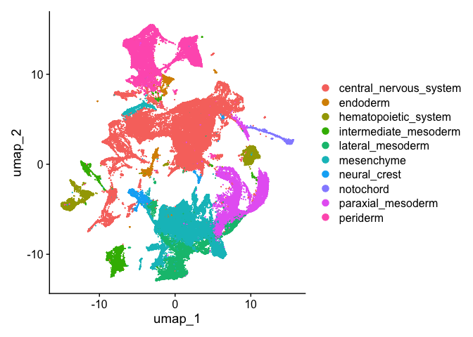
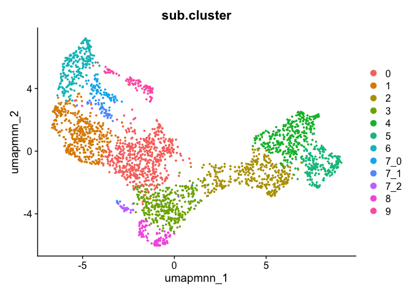
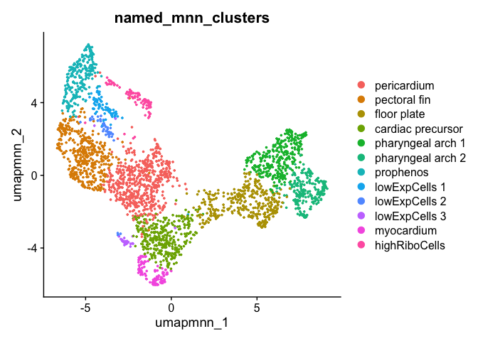
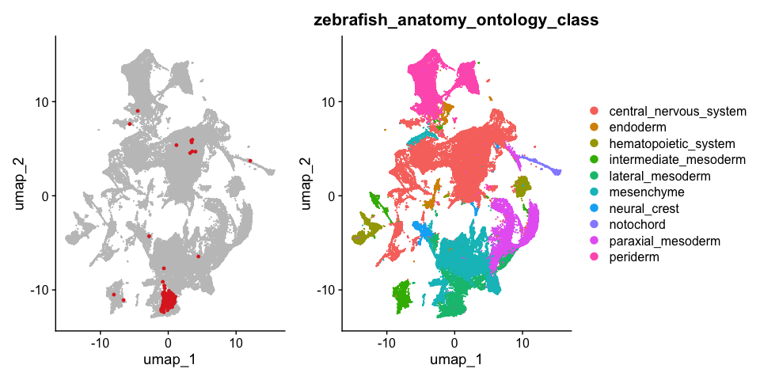
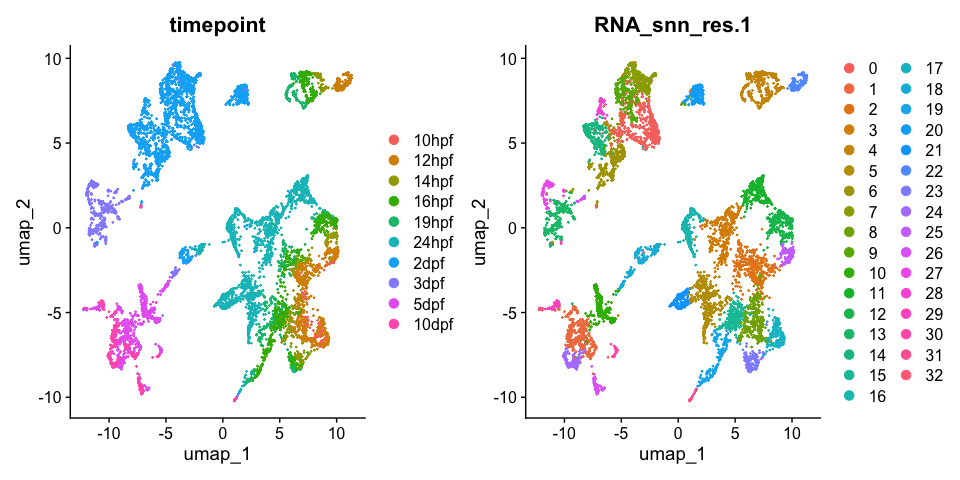
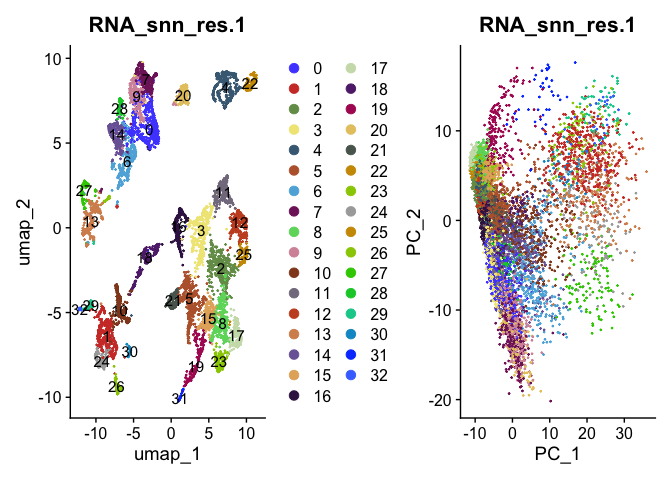
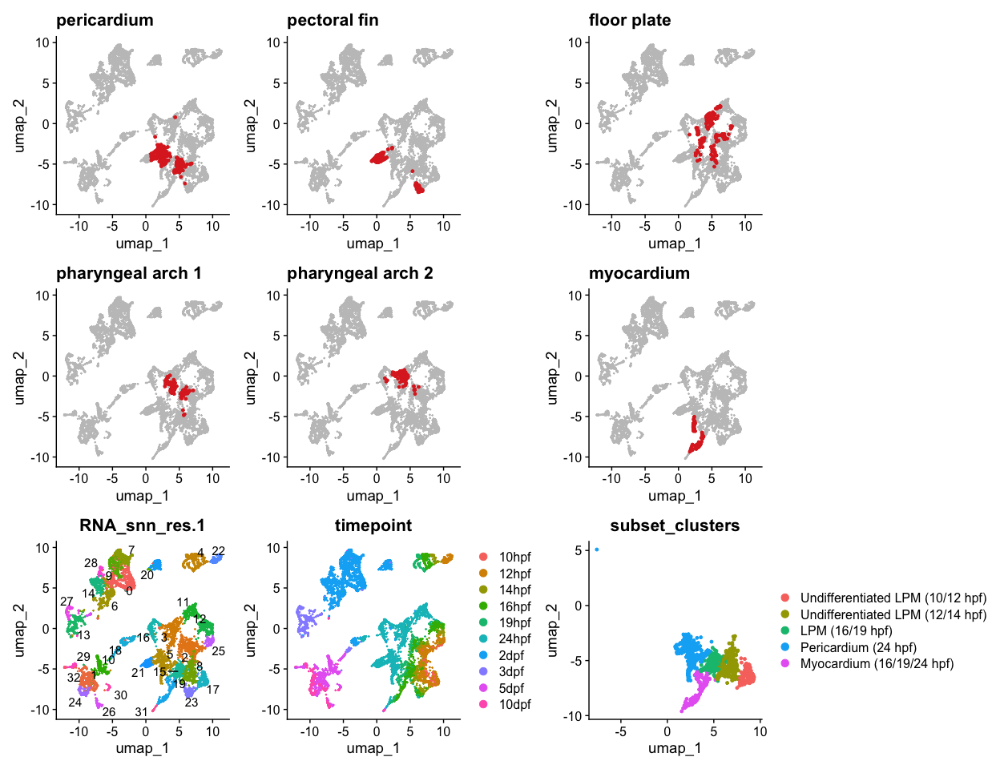
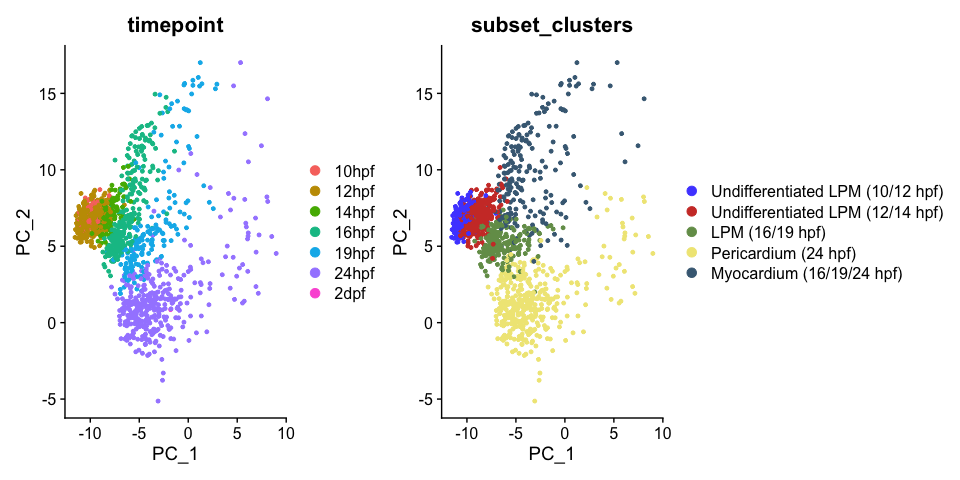
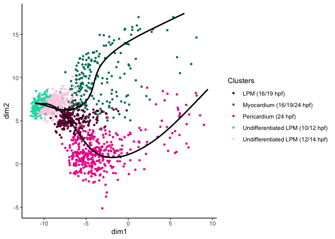

Lange scRNA-seq pseudotime R Notebook
================

# libraries

``` r
suppressPackageStartupMessages({
  library(reticulate)
  library(Seurat)
  library(dplyr)
  library(ggplot2)
  library(ggsci)
  library(patchwork)
  library(SeuratDisk)
  library(slingshot)
  library(tradeSeq)
  })
```

    ## Warning: package 'reticulate' was built under R version 4.3.2

    ## Warning: package 'Seurat' was built under R version 4.3.2

    ## Warning: package 'sp' was built under R version 4.3.2

    ## Warning: package 'ggplot2' was built under R version 4.3.2

    ## Warning: package 'ggsci' was built under R version 4.3.2

    ## Warning: package 'slingshot' was built under R version 4.3.1

    ## Warning: package 'TrajectoryUtils' was built under R version 4.3.2

    ## Warning: package 'SingleCellExperiment' was built under R version 4.3.1

    ## Warning: package 'SummarizedExperiment' was built under R version 4.3.1

    ## Warning: package 'MatrixGenerics' was built under R version 4.3.1

    ## Warning: package 'matrixStats' was built under R version 4.3.2

    ## Warning: package 'GenomicRanges' was built under R version 4.3.1

    ## Warning: package 'BiocGenerics' was built under R version 4.3.1

    ## Warning: package 'S4Vectors' was built under R version 4.3.2

    ## Warning: package 'IRanges' was built under R version 4.3.1

    ## Warning: package 'GenomeInfoDb' was built under R version 4.3.3

    ## Warning: package 'Biobase' was built under R version 4.3.1

    ## Warning: package 'tradeSeq' was built under R version 4.3.1

``` r
#library(reticulate)
#use_python(python = "/Users/becky/opt/miniconda3/bin/python3", required = TRUE)
options(future.globals.maxSize = 6000 * 1024^2)
```

``` r
mypal <- pal_ucscgb(palette = "default",alpha = 1)(25)
cbpal18 <- c("#68023F","#008169","#EF0096","#00DCB5","#FFCFE2",
           "#003C86","#9400E6","#009FFA","#FF71FD","#7CFFFA",
           "#6A0213","#008607","#F60239","#00E307","#FFDC3D","#ffea8a","#001310","#ffe9f1")
```

# read data

zebrafish single cell RNA-seq data downloaded from:
<https://zebrahub.ds.czbiohub.org/data>

``` r
Lange <- LoadH5Seurat(file = "~/Documents/Projects/Mosimann/Hannah_scRNAseq/data/zf_atlas_full_v4_release.h5seurat", assays = "RNA")
```

    ## Validating h5Seurat file

    ## Warning: Feature names cannot have underscores ('_'), replacing with dashes
    ## ('-')

    ## Initializing RNA with data

    ## Adding counts for RNA

    ## Adding feature-level metadata for RNA

    ## Adding reduction umap

    ## Adding cell embeddings for umap

    ## Adding miscellaneous information for umap

    ## Adding command information

    ## Adding cell-level metadata

``` r
Idents(Lange) <- "zebrafish_anatomy_ontology_class"
DimPlot(Lange, raster = FALSE)
```

<!-- -->
integrated scRNA-seq of Lange 16hpf, Lange 24hpf and our scRNA-seq

``` r
cardio <- readRDS(file = "~/Documents/Projects/Mosimann/Hannah_scRNAseq_Integration_SeuratV5/integrate_and_subset/CardioSubset_v3_Integrated_hand2Bud_Lange16hpf_Lange24hpf.RDS")
```

``` r
DimPlot(cardio, reduction = "umap.mnn", group.by = "sub.cluster")
```

<!-- -->

# name cardio clusters

``` r
Idents(cardio) <- "sub.cluster"
cardio <- RenameIdents(cardio,
                       "0" = "pericardium",
                       "1" = "pectoral fin",
                       "2" = "floor plate",
                       "3" = "cardiac precursor",
                       "4" = "pharyngeal arch 1",
                       "5" = "pharyngeal arch 2",
                       "6" = "prophenos",
                       "7_0" = "lowExpCells 1",
                       "7_1" = "lowExpCells 2",
                       "7_2" = "lowExpCells 3",
                       "8" = "myocardium",
                       "9" = "highRiboCells")
cardio$named_mnn_clusters <- Idents(cardio)
DimPlot(cardio, reduction = "umap.mnn", group.by = "named_mnn_clusters")
```

<!-- -->

# find pericardium cells in Lange dataset

``` r
tail(WhichCells(cardio))
```

    ## [1] "Lange_24hpf_TDR46_TCATCCGCAGCGTACC-1"
    ## [2] "Lange_24hpf_TDR43_AGTCAACCATCGGAGA-1"
    ## [3] "Lange_24hpf_TDR43_TCTCAGCTCTAGGCCG-1"
    ## [4] "Lange_24hpf_TDR44_CTCACTGCAGCTACAT-1"
    ## [5] "Lange_24hpf_TDR44_CCCGAAGTCCTGGGTG-1"
    ## [6] "Lange_24hpf_TDR43_TCAGTTTTCTCGCTTG-1"

``` r
gsub("Lange_24hpf_","",tail(WhichCells(cardio)))
```

    ## [1] "TDR46_TCATCCGCAGCGTACC-1" "TDR43_AGTCAACCATCGGAGA-1"
    ## [3] "TDR43_TCTCAGCTCTAGGCCG-1" "TDR44_CTCACTGCAGCTACAT-1"
    ## [5] "TDR44_CCCGAAGTCCTGGGTG-1" "TDR43_TCAGTTTTCTCGCTTG-1"

``` r
Idents(cardio) <- "named_mnn_clusters"
peri_cells <- gsub("Lange_16hpf_","",(gsub("Lange_24hpf_","",WhichCells(cardio, idents = "pericardium"))))
length(peri_cells)
```

    ## [1] 556

``` r
tail(peri_cells)
```

    ## [1] "TDR44_CCTATCGGTGCATTTG-1" "TDR46_AAACGCTGTGCGGTAA-1"
    ## [3] "TDR43_CATTCTAGTGTATCCA-1" "TDR44_CAATCGAAGAGAGCAA-1"
    ## [5] "TDR46_TCATCCGCAGCGTACC-1" "TDR44_CCCGAAGTCCTGGGTG-1"

``` r
head(WhichCells(Lange))
```

    ## [1] "TDR70_ACGTAACCAACTGATC-1" "TDR68_CAATCGAAGAGCTGAC-1"
    ## [3] "TDR39_TTTGACTAGAGGCCAT-1" "TDR36_TGATCTTGTCACTTAG-1"
    ## [5] "TDR48_GCGAGAAGTTATAGAG-1" "TDR70_TAAGTCGAGAAACTCA-1"

``` r
p1 <- DimPlot(Lange, cells.highlight = peri_cells, raster=FALSE) + NoLegend() 
p2 <- DimPlot(Lange, group.by = "zebrafish_anatomy_ontology_class", raster=FALSE)
p <- p1 + p2
p
```

<!-- -->

``` r
ggsave(filename = "results/Lange_full_UMAP.png", plot = p, width = 10, height = 5)
```

``` r
Idents(Lange) <- "zebrafish_anatomy_ontology_class"
lat_meso <- subset(Lange, idents = "lateral_mesoderm")
```

``` r
lat_meso <- FindVariableFeatures(lat_meso, verbose = F)
lat_meso <- ScaleData(lat_meso, verbose = F)
lat_meso <- RunPCA(lat_meso, verbose = F)
lat_meso <- FindNeighbors(lat_meso, dims = 1:20, verbose = F)
lat_meso <- RunUMAP(lat_meso, dims = 1:20, verbose = F)
```

    ## Warning: The default method for RunUMAP has changed from calling Python UMAP via reticulate to the R-native UWOT using the cosine metric
    ## To use Python UMAP via reticulate, set umap.method to 'umap-learn' and metric to 'correlation'
    ## This message will be shown once per session

    ## Found more than one class "dist" in cache; using the first, from namespace 'spam'

    ## Also defined by 'BiocGenerics'

    ## Found more than one class "dist" in cache; using the first, from namespace 'spam'

    ## Also defined by 'BiocGenerics'

``` r
lat_meso <- FindClusters(lat_meso, resolution = 1, verbose = F)
DimPlot(lat_meso, group.by = c("timepoint","RNA_snn_res.1"))
```

<!-- -->

# cluster IDs of lateral mesoderm subset

Note cardio scRNA-seq contains only Lange 16hpf and Lange 24hpf along
with our bud stage data, so only 16hpf and 24hpf Lange cells will be
highlighted.

``` r
pecfin_cells <- gsub("Lange_16hpf_","",(gsub("Lange_24hpf_","",WhichCells(cardio, idents = "pectoral fin"))))
FP_cells <- gsub("Lange_16hpf_","",(gsub("Lange_24hpf_","",WhichCells(cardio, idents = "floor plate"))))
parch1_cells <- gsub("Lange_16hpf_","",(gsub("Lange_24hpf_","",WhichCells(cardio, idents = "pharyngeal arch 1"))))
parch2_cells <- gsub("Lange_16hpf_","",(gsub("Lange_24hpf_","",WhichCells(cardio, idents = "pharyngeal arch 2"))))
cardio_cells <- gsub("Lange_16hpf_","",(gsub("Lange_24hpf_","",WhichCells(cardio, idents = "myocardium"))))
```

``` r
p1 <- DimPlot(lat_meso, reduction = "umap", cells.highlight = peri_cells) + NoLegend() + ggtitle("pericardium")
p2 <- DimPlot(lat_meso, reduction = "umap", cells.highlight = pecfin_cells) + NoLegend() + ggtitle("pectoral fin")
p3 <- DimPlot(lat_meso, reduction = "umap", cells.highlight = FP_cells) + NoLegend() + ggtitle("floor plate")
p4 <- DimPlot(lat_meso, reduction = "umap", cells.highlight = parch1_cells) + NoLegend() + ggtitle("pharyngeal arch 1")
p5 <- DimPlot(lat_meso, reduction = "umap", cells.highlight = parch2_cells) + NoLegend() + ggtitle("pharyngeal arch 2")
p6 <- DimPlot(lat_meso, reduction = "umap", cells.highlight = cardio_cells) + NoLegend() + ggtitle("myocardium")
p7 <- DimPlot(lat_meso, group.by = "RNA_snn_res.1", label = T, repel = T) + NoLegend()
p8 <- DimPlot(lat_meso, group.by = "timepoint")
p1 + p2 + p3 + p4 + p5 + p6 + p7 + p8
```

<!-- -->

# subset cardiomyocytes, pericardium and precursor clusters

``` r
p1 <- DimPlot(lat_meso, group.by = "RNA_snn_res.1", label = T) + scale_color_igv()
p2 <- DimPlot(lat_meso, group.by = "RNA_snn_res.1", reduction = 'pca') + scale_color_igv() + NoLegend()
p1 + p2
```

<!-- -->

select:

- 17 – early timepoint cells (10/12hpf)
- 8 – early timepoint cells (12/14hpf)
- 15 – pericardium (16/19hpf)
- 5 – pericardium (24hpf)
- 19 – cardiomyocytes (16/19/24hpf)

leaving out:

- 21, 23 – pectoral fin cells
- 31 – late timepoint cardiomyocytes because don’t have pericarium late
  timepoint cells

``` r
Idents(lat_meso) <- "RNA_snn_res.1"
lat_meso2 <- subset(lat_meso, idents = c("17","8","15","5","19"))
lat_meso2 <- RenameIdents(lat_meso2,
                          "17" = "Undifferentiated LPM (10/12 hpf)",
                          "8" = "Undifferentiated LPM (12/14 hpf)",
                          "15" = "LPM (16/19 hpf)",
                          "5" = "Pericardium (24 hpf)",
                          "19" = "Myocardium (16/19/24 hpf)")
lat_meso2$subset_clusters <- Idents(lat_meso2)
```

``` r
p1 <- DimPlot(lat_meso, reduction = "umap", cells.highlight = peri_cells) + NoLegend() + ggtitle("pericardium")
p2 <- DimPlot(lat_meso, reduction = "umap", cells.highlight = pecfin_cells) + NoLegend() + ggtitle("pectoral fin")
p3 <- DimPlot(lat_meso, reduction = "umap", cells.highlight = FP_cells) + NoLegend() + ggtitle("floor plate")
p4 <- DimPlot(lat_meso, reduction = "umap", cells.highlight = parch1_cells) + NoLegend() + ggtitle("pharyngeal arch 1")
p5 <- DimPlot(lat_meso, reduction = "umap", cells.highlight = parch2_cells) + NoLegend() + ggtitle("pharyngeal arch 2")
p6 <- DimPlot(lat_meso, reduction = "umap", cells.highlight = cardio_cells) + NoLegend() + ggtitle("myocardium")
p7 <- DimPlot(lat_meso, group.by = "RNA_snn_res.1", label = T, repel = T) + NoLegend()
p8 <- DimPlot(lat_meso, group.by = "timepoint")
p9 <- DimPlot(lat_meso2, group.by = "subset_clusters")
p <- p1 + p2 + p3 + p4 + p5 + p6 + p7 + p8 + p9
p
```

<!-- -->

``` r
ggsave(filename = "results/Lange_lat_meso_subset_UMAP.png", plot = p, width = 13, height = 10)
```

``` r
p <- DimPlot(lat_meso2, reduction = "pca", group.by = c("timepoint","subset_clusters")) + scale_color_igv()
p
```

<!-- -->

``` r
ggsave(filename = "results/Lange_pericardium_subset_pca.png", plot = p, width = 10, height = 5)
```

# slingshot

``` r
Idents(lat_meso2) <- "subset_clusters"
sce <- as.SingleCellExperiment(lat_meso2, assay = 'RNA')
saveRDS(sce, file = "RDSfiles/Lange_lat_meso2_subset_res1_noPecFin.sce.RDS")
```

``` r
crv <- slingshot(sce, reducedDim = 'PCA', 
                 clusterLabels = colData(sce)$subset_clusters,
                 start.clus = '10/12hpf cells')
```

``` r
crv@colData@listData[["slingshot"]]@metadata[["lineages"]][["Lineage1"]]
```

    ## [1] "Undifferentiated LPM (10/12 hpf)" "Undifferentiated LPM (12/14 hpf)"
    ## [3] "LPM (16/19 hpf)"                  "Pericardium (24 hpf)"

``` r
crv@colData@listData[["slingshot"]]@metadata[["lineages"]][["Lineage2"]]
```

    ## [1] "Undifferentiated LPM (10/12 hpf)" "Undifferentiated LPM (12/14 hpf)"
    ## [3] "LPM (16/19 hpf)"                  "Myocardium (16/19/24 hpf)"

``` r
p <- plotGeneCount(crv, clusters = colData(sce)$subset_clusters) + scale_color_manual(values = cbpal18)
p
```

<!-- -->

``` r
ggsave(filename = "results/Lange_slingshot.png")
```

    ## Saving 7 x 5 in image

``` r
sessionInfo()
```

    ## R version 4.3.0 (2023-04-21)
    ## Platform: x86_64-apple-darwin20 (64-bit)
    ## Running under: macOS Monterey 12.6.2
    ## 
    ## Matrix products: default
    ## BLAS:   /Library/Frameworks/R.framework/Versions/4.3-x86_64/Resources/lib/libRblas.0.dylib 
    ## LAPACK: /Library/Frameworks/R.framework/Versions/4.3-x86_64/Resources/lib/libRlapack.dylib;  LAPACK version 3.11.0
    ## 
    ## locale:
    ## [1] en_US.UTF-8/en_US.UTF-8/en_US.UTF-8/C/en_US.UTF-8/en_US.UTF-8
    ## 
    ## time zone: America/Denver
    ## tzcode source: internal
    ## 
    ## attached base packages:
    ## [1] stats4    stats     graphics  grDevices utils     datasets  methods  
    ## [8] base     
    ## 
    ## other attached packages:
    ##  [1] tradeSeq_1.16.0             slingshot_2.10.0           
    ##  [3] TrajectoryUtils_1.10.1      SingleCellExperiment_1.24.0
    ##  [5] SummarizedExperiment_1.32.0 Biobase_2.62.0             
    ##  [7] GenomicRanges_1.54.1        GenomeInfoDb_1.38.8        
    ##  [9] IRanges_2.36.0              S4Vectors_0.40.2           
    ## [11] BiocGenerics_0.48.1         MatrixGenerics_1.14.0      
    ## [13] matrixStats_1.3.0           princurve_2.1.6            
    ## [15] SeuratDisk_0.0.0.9021       patchwork_1.2.0            
    ## [17] ggsci_3.0.3                 ggplot2_3.5.0              
    ## [19] dplyr_1.1.4                 Seurat_5.0.3               
    ## [21] SeuratObject_5.0.1          sp_2.1-3                   
    ## [23] reticulate_1.35.0          
    ## 
    ## loaded via a namespace (and not attached):
    ##   [1] RcppAnnoy_0.0.22          splines_4.3.0            
    ##   [3] later_1.3.2               bitops_1.0-7             
    ##   [5] tibble_3.2.1              polyclip_1.10-6          
    ##   [7] fastDummies_1.7.3         lifecycle_1.0.4          
    ##   [9] edgeR_4.0.16              globals_0.16.3           
    ##  [11] lattice_0.22-6            hdf5r_1.3.11             
    ##  [13] MASS_7.3-60.0.1           magrittr_2.0.3           
    ##  [15] limma_3.58.1              plotly_4.10.4            
    ##  [17] rmarkdown_2.26            yaml_2.3.8               
    ##  [19] httpuv_1.6.15             sctransform_0.4.1        
    ##  [21] spam_2.10-0               spatstat.sparse_3.0-3    
    ##  [23] cowplot_1.1.3             pbapply_1.7-2            
    ##  [25] RColorBrewer_1.1-3        abind_1.4-5              
    ##  [27] zlibbioc_1.48.2           Rtsne_0.17               
    ##  [29] purrr_1.0.2               RCurl_1.98-1.14          
    ##  [31] GenomeInfoDbData_1.2.11   ggrepel_0.9.5            
    ##  [33] irlba_2.3.5.1             listenv_0.9.1            
    ##  [35] spatstat.utils_3.1-0      goftest_1.2-3            
    ##  [37] RSpectra_0.16-1           spatstat.random_3.2-3    
    ##  [39] fitdistrplus_1.1-11       parallelly_1.37.1        
    ##  [41] DelayedMatrixStats_1.24.0 leiden_0.4.3.1           
    ##  [43] codetools_0.2-20          DelayedArray_0.28.0      
    ##  [45] tidyselect_1.2.1          farver_2.1.2             
    ##  [47] viridis_0.6.5             spatstat.explore_3.2-7   
    ##  [49] jsonlite_1.8.8            progressr_0.14.0         
    ##  [51] ggridges_0.5.6            survival_3.5-8           
    ##  [53] systemfonts_1.0.6         tools_4.3.0              
    ##  [55] ragg_1.3.0                ica_1.0-3                
    ##  [57] Rcpp_1.0.12               glue_1.7.0               
    ##  [59] gridExtra_2.3             SparseArray_1.2.4        
    ##  [61] xfun_0.43                 mgcv_1.9-1               
    ##  [63] withr_3.0.0               fastmap_1.2.0            
    ##  [65] fansi_1.0.6               digest_0.6.36            
    ##  [67] R6_2.5.1                  mime_0.12                
    ##  [69] textshaping_0.3.7         colorspace_2.1-0         
    ##  [71] scattermore_1.2           tensor_1.5               
    ##  [73] spatstat.data_3.0-4       utf8_1.2.4               
    ##  [75] tidyr_1.3.1               generics_0.1.3           
    ##  [77] data.table_1.15.4         httr_1.4.7               
    ##  [79] htmlwidgets_1.6.4         S4Arrays_1.2.1           
    ##  [81] uwot_0.1.16               pkgconfig_2.0.3          
    ##  [83] gtable_0.3.4              lmtest_0.9-40            
    ##  [85] XVector_0.42.0            htmltools_0.5.8.1        
    ##  [87] dotCall64_1.1-1           scales_1.3.0             
    ##  [89] png_0.1-8                 knitr_1.45               
    ##  [91] rstudioapi_0.16.0         reshape2_1.4.4           
    ##  [93] nlme_3.1-165              zoo_1.8-12               
    ##  [95] stringr_1.5.1             KernSmooth_2.23-24       
    ##  [97] parallel_4.3.0            miniUI_0.1.1.1           
    ##  [99] pillar_1.9.0              grid_4.3.0               
    ## [101] vctrs_0.6.5               RANN_2.6.1               
    ## [103] promises_1.3.0            xtable_1.8-4             
    ## [105] cluster_2.1.6             evaluate_0.24.0          
    ## [107] cli_3.6.3                 locfit_1.5-9.10          
    ## [109] compiler_4.3.0            rlang_1.1.3              
    ## [111] crayon_1.5.3              future.apply_1.11.2      
    ## [113] labeling_0.4.3            plyr_1.8.9               
    ## [115] stringi_1.8.3             viridisLite_0.4.2        
    ## [117] deldir_2.0-4              BiocParallel_1.36.0      
    ## [119] munsell_0.5.1             lazyeval_0.2.2           
    ## [121] spatstat.geom_3.2-9       Matrix_1.6-5             
    ## [123] RcppHNSW_0.6.0            sparseMatrixStats_1.14.0 
    ## [125] bit64_4.0.5               future_1.33.2            
    ## [127] statmod_1.5.0             shiny_1.8.1.1            
    ## [129] highr_0.10                ROCR_1.0-11              
    ## [131] igraph_2.0.3              bit_4.0.5
