R Notebook
================

This notebook subsets the cluster containing pericardium cells from the
Lange et al () 10 hpf - 10dpf dataset and analyzes this subset at early
timepoints (12hpf - 19hpf) for divergence of pericardium and myocardium
cells.

# 1. libraries and palette

``` r
suppressPackageStartupMessages({
  library(Seurat)
  library(dplyr)
  library(ggplot2)
  library(ggsci)
  library(patchwork)
  #library(SeuratWrappers)
  #library(SeuratDisk)
}) 
```

    ## Warning: package 'Seurat' was built under R version 4.3.2

    ## Warning: package 'sp' was built under R version 4.3.2

    ## Warning: package 'ggplot2' was built under R version 4.3.2

    ## Warning: package 'ggsci' was built under R version 4.3.2

``` r
options(future.globals.maxSize = 4000 * 1024^2)
#options(Seurat.object.assay.version = "v3")
#options(Seurat.object.assay.version = "v5")
```

# 2. Read data

## 2.1 Lange full dataset

This is the 10hpf - 10dpf Lange dataset

``` r
Lange <- readRDS(file = "RDSfiles/Lange_full_seurat.RDS")
Idents(Lange) <- "zebrafish_anatomy_ontology_class"
p.langefull <- DimPlot(Lange, group.by = c("zebrafish_anatomy_ontology_class"), raster = F)
p.langefull
```

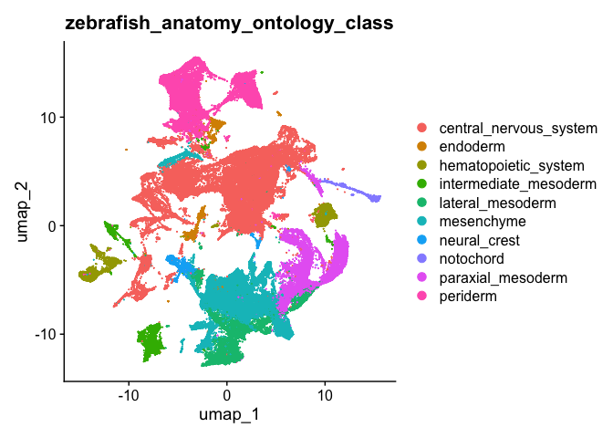<!-- -->
\## 2.2 integrated subset for cluster ID This is a subset of our
scRNA-seq integrated with Lange 16hpf and Lange 24hpf cells that we will
use to help ID cells.

``` r
cardio <- readRDS(file = "~/Documents/Projects/Mosimann/Hannah_scRNAseq_Integration_SeuratV5/integrate_and_subset/CardioSubset_v3_Integrated_hand2Bud_Lange16hpf_Lange24hpf.RDS")
```

``` r
DimPlot(cardio, reduction = "umap.mnn", group.by = "sub.cluster")
```

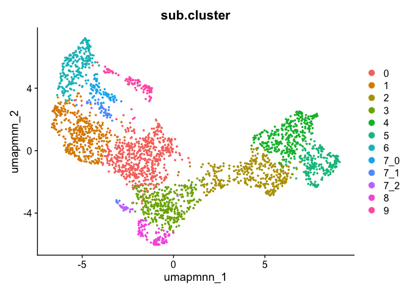<!-- -->

``` r
Idents(cardio) <- "sub.cluster"
cardio <- RenameIdents(cardio,
                       "0" = "pericardium",
                       "1" = "pectoral fin",
                       "2" = "floor plate",
                       "3" = "cardiac precursor",
                       "4" = "pharyngeal arch 1",
                       "5" = "pharyngeal arch 2",
                       "6" = "prophenos",
                       "7_0" = "lowExpCells 1",
                       "7_1" = "lowExpCells 2",
                       "7_2" = "lowExpCells 3",
                       "8" = "myocardium",
                       "9" = "highRiboCells")
cardio$named_mnn_clusters <- Idents(cardio)
DimPlot(cardio, reduction = "umap.mnn", group.by = "named_mnn_clusters")
```

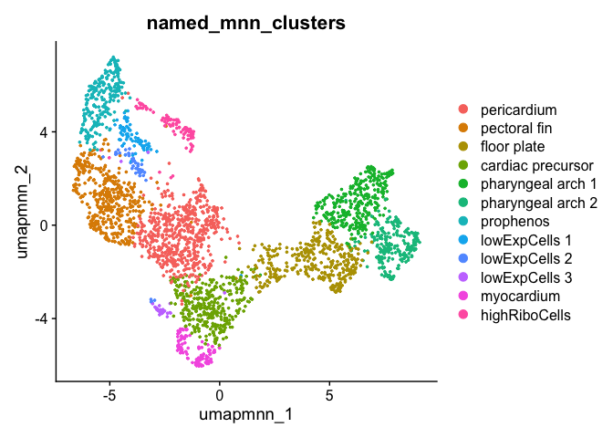<!-- -->

# 3. Subset pericardium early cells from Lange dataset

## 3.1 find cluster containing pericardium cells

First find pericardium cells in Lange full dataset

``` r
head(WhichCells(Lange))
```

    ## [1] "TDR70_ACGTAACCAACTGATC-1" "TDR68_CAATCGAAGAGCTGAC-1"
    ## [3] "TDR39_TTTGACTAGAGGCCAT-1" "TDR36_TGATCTTGTCACTTAG-1"
    ## [5] "TDR48_GCGAGAAGTTATAGAG-1" "TDR70_TAAGTCGAGAAACTCA-1"

``` r
tail(WhichCells(cardio))
```

    ## [1] "Lange_24hpf_TDR46_TCATCCGCAGCGTACC-1"
    ## [2] "Lange_24hpf_TDR43_AGTCAACCATCGGAGA-1"
    ## [3] "Lange_24hpf_TDR43_TCTCAGCTCTAGGCCG-1"
    ## [4] "Lange_24hpf_TDR44_CTCACTGCAGCTACAT-1"
    ## [5] "Lange_24hpf_TDR44_CCCGAAGTCCTGGGTG-1"
    ## [6] "Lange_24hpf_TDR43_TCAGTTTTCTCGCTTG-1"

``` r
gsub("Lange_24hpf_","",tail(WhichCells(cardio)))
```

    ## [1] "TDR46_TCATCCGCAGCGTACC-1" "TDR43_AGTCAACCATCGGAGA-1"
    ## [3] "TDR43_TCTCAGCTCTAGGCCG-1" "TDR44_CTCACTGCAGCTACAT-1"
    ## [5] "TDR44_CCCGAAGTCCTGGGTG-1" "TDR43_TCAGTTTTCTCGCTTG-1"

``` r
Idents(cardio) <- "named_mnn_clusters"
peri_cells <- gsub("Lange_16hpf_","",(gsub("Lange_24hpf_","",WhichCells(cardio, idents = "pericardium"))))
length(peri_cells)
```

    ## [1] 556

``` r
pecfin_cells <- gsub("Lange_16hpf_","",(gsub("Lange_24hpf_","",WhichCells(cardio, idents = "pectoral fin"))))
FP_cells <- gsub("Lange_16hpf_","",(gsub("Lange_24hpf_","",WhichCells(cardio, idents = "floor plate"))))
parch1_cells <- gsub("Lange_16hpf_","",(gsub("Lange_24hpf_","",WhichCells(cardio, idents = "pharyngeal arch 1"))))
parch2_cells <- gsub("Lange_16hpf_","",(gsub("Lange_24hpf_","",WhichCells(cardio, idents = "pharyngeal arch 2"))))
cardio_cells <- gsub("Lange_16hpf_","",(gsub("Lange_24hpf_","",WhichCells(cardio, idents = "myocardium"))))
```

``` r
p.peri.full <- DimPlot(Lange, cells.highlight = peri_cells, raster=FALSE) + NoLegend() + ggtitle("pericardium cells")
p.peri.full
```

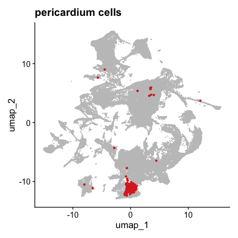<!-- -->

Pericardium cells are in the “lateral mesoderm” cluster.

``` r
Idents(Lange) <- "zebrafish_anatomy_ontology_class"
Lange_latmeso <- subset(Lange, idents = "lateral_mesoderm")
DimPlot(Lange_latmeso, raster = FALSE)
```

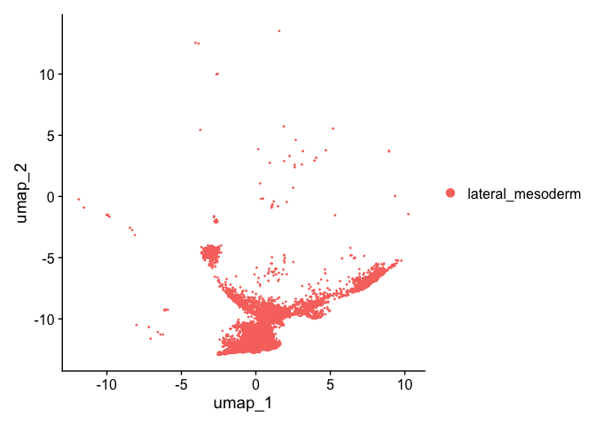<!-- -->
Select early timepoint cells.

``` r
Idents(Lange_latmeso) <- "timepoint"
Lange_sub <- subset(Lange_latmeso, idents = c("12hpf","14hpf","16hpf","19hpf"))
DimPlot(Lange_sub, raster = FALSE)
```

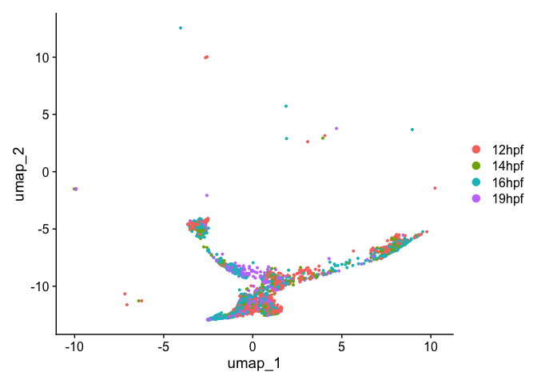<!-- -->

``` r
Lange_sub[["RNA"]] <- as(object = Lange_sub[["RNA"]], Class = "Assay5")
```

    ## Warning: Assay RNA changing from Assay to Assay5

## 3.2 name lateral mesoderm clusters

The individual timepoint Lange 24hpf dataset has more refined cluster
names. Will use this to name clusters in our Lange 12-19hpf lateral
mesoderm subset.

``` r
Lange24hpf <- readRDS(file = "~/Documents/Projects/Mosimann/Hannah_scRNAseq_github/notebooks/RDSfiles/Lange24hpf.RDS")
DimPlot(Lange24hpf, group.by = "zebrafish_anatomy_ontology_class")
```

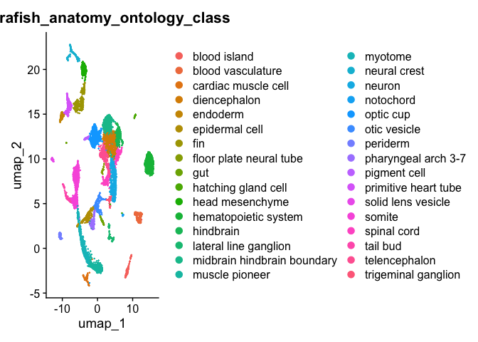<!-- -->

``` r
Lange24hpf <- NormalizeData(Lange24hpf)
Lange24hpf <- FindVariableFeatures(Lange24hpf)
Lange24hpf <- ScaleData(Lange24hpf)
```

    ## Centering and scaling data matrix

``` r
Lange24hpf <- RunPCA(Lange24hpf)
```

    ## PC_ 1 
    ## Positive:  tubb2b, si:ch211-222l21.1, hmgb2b, h3f3b.1, ptmab, seta, hmgb2a, si:ch73-1a9.3, cirbpa, anp32a 
    ##     rbbp4, tuba8l4, hmgn2, chd4a, tubb4b, pcna, hmgb1b, si:ch211-288g17.3, dut, anp32b 
    ##     hnrnpaba, nasp, hist1h4l-16, chaf1a, si:ch73-281n10.2, stmn1a, cbx3a, hnrnpa1b, lbr, baz1b 
    ## Negative:  txlnba, klhl31, smyd2b, rbfox1l, klhl40b, klhl41b, smyd1b, CABZ01078594.1, ldb3a, stac3 
    ##     si:ch211-131k2.3, zgc:92518, ryr1b, txlnbb, actc1a, CABZ01072309.2, zgc:92429, obscnb, si:dkey-74k8.3, unc45b 
    ##     tmem38a, mybphb, SRL, cacng1a, tmx2a, aimp1b, nexn, CR376766.2, hjv, mss51 
    ## PC_ 2 
    ## Positive:  fabp3, ncl, c1qbp, fxr2, klhl31, smyd2b, stac3, klhl40b, mss51, tmx2a 
    ##     zgc:92429, txlnbb, txlnba, npm1a, cacng1a, phactr3b, tmem38a, si:ch211-131k2.3, snu13b, klhl41b 
    ##     ryr1b, CR376766.2, smyd1b, usp13, rbfox1l, hjv, unc45b, zgc:92518, actc1a, dkc1 
    ## Negative:  arhgdig, myh9a, pycard, gpa33a, pfn1, cdh1, gsnb, lgals3b, sh3d21, rac2 
    ##     tagln2, hcls1, spint1a, tmsb1, st14a, f11r.1, cavin2a, si:dkey-16l2.20, actb1, krt8 
    ##     sult2st1, scinla, spaca4l, epcam, zgc:174938, abracl, ptk2bb, mapk12a, zgc:153867, s100a10b 
    ## PC_ 3 
    ## Positive:  si:ch73-46j18.5, hmgb3a, sparc, pfn2l, nucks1a, mdka, pbx4, dag1, marcksb, id1 
    ##     meis1b, pleca, lin28a, fabp3, foxp4, col11a1a, zfhx3, boc, col5a1, cx43.4 
    ##     bcam, col18a1a, akap12b, col4a6, col2a1b, meis1a, fstl1a, fkbp9, ppib, fstl1b 
    ## Negative:  si:ch73-248e21.7, itgb2, grap2b, f13a1b, plxnc1, ptprc, fcer1gl, spi1b, samsn1a, cybb 
    ##     si:dkey-185m8.2, spi1a, cxcr3.2, lcp1, CABZ01041494.1, fcer1g, coro1a, gpr183a, CABZ01073834.1, wasb 
    ##     si:zfos-2330d3.7-1, si:ch211-243a20.4, glipr1a, myo1f, ncf2, ccdc88b, itgae.2, fmnl1a, FO203432.1, laptm5 
    ## PC_ 4 
    ## Positive:  zgc:163057, epb41b, rfesd, hemgn, nmt1b, alas2, cahz, tfr1a, slc4a1a, gata1a 
    ##     hdr, klf1, si:ch211-227m13.1, drl, si:ch211-207c6.2, klf17, nt5c2l1, rhd, hbae5, cldng 
    ##     hbbe2, hbae1.3-1, fth1a, fech, hmbsb, hbae1.1, hbbe1.2, blf, hbae1.3, hbbe1.1 
    ## Negative:  atp1a3a, sncb, ckbb, vamp2, stx1b, gng3, aplp1, stxbp1a, ppfia3, itgb2 
    ##     plxnc1, sypa, cybb, fcer1gl, si:dkey-280e21.3, lcp1, cxcr3.2, samsn1a, kif5aa, fmnl1a 
    ##     mllt11, ptprc, syk, fcer1g, spi1a, si:dkey-185m8.2, stmn2b, snap25a, map1aa, CABZ01041494.1 
    ## PC_ 5 
    ## Positive:  add2, aplp1, ppfia3, gng3, vamp2, sypa, sncb, kif5aa, carmil2, sv2a 
    ##     stmn2b, stx1b, mllt11, tuba2, pacsin1a, rab6bb, fez1, apc2, zgc:65894, cpe 
    ##     snap25a, map1aa, stxbp1a, elavl4, ndrg4, rtn1b, si:dkey-178k16.1, kif1aa, pclob, maptb 
    ## Negative:  cd81a, marcksl1a, id1, tpm4a, nucks1a, fstl1b, si:dkey-261h17.1, mfap2, colec12, si:ch211-286o17.1 
    ##     asph, cx43.4, tln1, pmp22a, krt18b, mdka, pfn2l, col5a1, parp1, lsp1a 
    ##     boc, pdgfra, igf2bp1, twist1a, sparc, cfl1, marcksl1b, serpinh1b, prrx1a, fkbp7

``` r
anchors <- FindTransferAnchors(reference = Lange24hpf, query = Lange_sub, dims = 1:30,
    reference.reduction = "pca")
```

    ## Projecting cell embeddings

    ## Finding neighborhoods

    ## Finding anchors

    ##  Found 1174 anchors

``` r
predictions <- TransferData(anchorset = anchors, refdata = Lange24hpf$zebrafish_anatomy_ontology_class, dims = 1:30)
```

    ## Finding integration vectors

    ## Finding integration vector weights

    ## Predicting cell labels

``` r
Lange_sub <- AddMetaData(Lange_sub, metadata = predictions)
```

``` r
Lange_sub[["RNA"]] <- split(Lange_sub[["RNA"]], f = Lange_sub$timepoint)
```

``` r
Lange_sub <- NormalizeData(Lange_sub)
```

    ## Normalizing layer: counts.12hpf

    ## Normalizing layer: counts.14hpf

    ## Normalizing layer: counts.16hpf

    ## Normalizing layer: counts.19hpf

``` r
Lange_sub <- FindVariableFeatures(Lange_sub)
```

    ## Finding variable features for layer counts.12hpf

    ## Finding variable features for layer counts.14hpf

    ## Finding variable features for layer counts.16hpf

    ## Finding variable features for layer counts.19hpf

``` r
Lange_sub <- ScaleData(Lange_sub)
```

    ## Centering and scaling data matrix

``` r
Lange_sub <- RunPCA(Lange_sub)
```

    ## PC_ 1 
    ## Positive:  cbx3a, snu13b, fbl, dkc1, nop58, anp32b, nop56, npm1a, pcna, rbbp4 
    ##     nop2, gnl3, ncl, si:ch211-217k17.7, prmt1, sumo3b, ranbp1, chaf1a, rsl1d1, mphosph10 
    ##     pclaf, dek, nasp, mki67, ssrp1a, twistnb, fen1, mybbp1a, lig1, tubb2b 
    ## Negative:  tnnt2a, tnni1b, smtnl1, myl7, atp2a2a, ryr2b, cmlc1, ccdc141, myh7, podxl 
    ##     myh7bb, tnnc1a, pcdh10a, spega, rbfox1l, lama5, mylk3, alpk3a, mmel1, gata6 
    ##     cacna1g, prkag2a, rbpms2b, mef2cb, synpo2lb, klhl31, tdgf1, cd151, actn2b, tbx20 
    ## PC_ 2 
    ## Positive:  apoeb, si:ch211-152c2.3, vox, fthl27, apoc1, hspb1, cdca7a, ucp2, gata5, cx43.4 
    ##     lima1a, si:ch211-222l21.1, cdh1, nucks1a, si:ch73-22o12.1, abracl, mcm3, osr1, ptmab, ved 
    ##     arl4d, foxh1, fn1a, cdx4, fgfrl1b, tuba1a, anxa4, dhrs9, hand2, ftr82 
    ## Negative:  ahnak, tgfbi, emp2, efemp2a, col5a1, si:ch211-286o17.1, CU457819.1, comp, CU459186.2, zgc:173552-5 
    ##     FQ312024.1, mdka, zgc:173552, hist1h4l-14, hist1h2a3-1, angptl7, CR762436.2, col4a2, igfbp5b, sparc 
    ##     rgmd, vwde, col4a1, hist2h3c, zgc:173552-3, CU459186.3, zgc:158463, nr2f5, thbs4b, si:dkey-23a13.21 
    ## PC_ 3 
    ## Positive:  efemp2b, fn1b, tuba8l2, meox1, tcf15, col4a1, kazald2, dmrt2a, col4a2, cpn1-1 
    ##     aldh1a2, rdh10a, hsp90aa1.1, angptl7, fstl1a, thbs4b, draxin, znfl1k, fgfrl1a, hoxc6b 
    ##     ripply1, hspb1, ppp1r14c, ttn.1, dld, ccdc120, uncx4.1, bmpr1ba, vwde, plekhg4 
    ## Negative:  ednrab, tfap2a, inka1a, zbtb16b, zbtb16a, marcksl1b, slc1a3a, cxxc5a, sox10, kctd15a 
    ##     tuba8l3, sox6, ccnd2a, crestin, mycn, ptgdsb.1, her9, tubb5, nrp2a, sept12 
    ##     zeb2a, dlx2a, fabp3, pdgfbb, foxd3, aldob, zfhx4, fscn1a, sox5, kalrnb 
    ## PC_ 4 
    ## Positive:  tfap2a, pax3a, sox10, nr2f5, foxd3, ptgdsb.1, fabp3, c1qbp, ednrab, col18a1a 
    ##     mt-atp6, sox9b, kalrnb, timm8b, kctd15a, crabp2b, cd82a, atp1b3a, hsp90ab1, BX927258.1 
    ##     ptgdsb.2, cdh6, crestin, hspd1, mdkb, lmo4b, cdkn1ca, nme2b.1, si:ch73-364h19.1, ttn.1 
    ## Negative:  aplnra, ebf3a-1, six1a, pdgfrb, foxc1a, colec12, cxcl12b, pitx3, six2a, tsku 
    ##     robo4, foxl2a, foxc1b, capgb, tbx1, scube3, cox4i2, col2a1b, ephb3a, pknox2 
    ##     stox1, pcdh7b, prrx1a, zgc:101100, tmem119b, eya2, ndnfl, cxadr, sgms1, lsp1a 
    ## PC_ 5 
    ## Positive:  jam2b, CR762480.2, emilin2b, pcolcea, FRMD1, fbln1, tbx2a, hoxb3a, cd81a, sema3e 
    ##     bnc2, prrx1a, raraa, hoxb6b, ddr1, si:dkey-73n10.1, si:ch211-197h24.9, si:dkey-12j5.1, sfrp5, cfd 
    ##     snai2, hoxc1a, hoxb5b, hmga2, nrp2b, cdh11, zgc:158463, tmem88b, BX001014.2, si:ch211-286o17.1 
    ## Negative:  col15a1b, si:ch211-152c2.3, ucp2, zic2b, stm, tnnc1a, cx36.7, mtus1a, atp1b1a, fhl2a 
    ##     myh7l, obsl1a, has2, ryr2b, hspb7, zgc:66433, alpk2, dub, myh7, fscn1a 
    ##     lmo7a, arid3b, vcana, mylk3, cmlc1, slc8a1a, ccdc141, myl7, lmx1bb, otx1

This is the Lange lateral mesoderm 12hpf - 19hpf subset with cell ID’s
predicted using the Lange 24hpf cluster naming.

``` r
Lange_sub <- RunUMAP(Lange_sub, dims = 1:30, reduction = "pca")
```

    ## Warning: The default method for RunUMAP has changed from calling Python UMAP via reticulate to the R-native UWOT using the cosine metric
    ## To use Python UMAP via reticulate, set umap.method to 'umap-learn' and metric to 'correlation'
    ## This message will be shown once per session

    ## 17:09:03 UMAP embedding parameters a = 0.9922 b = 1.112

    ## 17:09:03 Read 2324 rows and found 30 numeric columns

    ## 17:09:03 Using Annoy for neighbor search, n_neighbors = 30

    ## 17:09:03 Building Annoy index with metric = cosine, n_trees = 50

    ## 0%   10   20   30   40   50   60   70   80   90   100%

    ## [----|----|----|----|----|----|----|----|----|----|

    ## **************************************************|
    ## 17:09:03 Writing NN index file to temp file /var/folders/pz/z8hs91417hl_gzxjrv4pmvyw0000gp/T//RtmpECmCwu/fileaf92546b1e6e
    ## 17:09:03 Searching Annoy index using 1 thread, search_k = 3000
    ## 17:09:03 Annoy recall = 100%
    ## 17:09:03 Commencing smooth kNN distance calibration using 1 thread with target n_neighbors = 30
    ## 17:09:04 Initializing from normalized Laplacian + noise (using RSpectra)
    ## 17:09:04 Commencing optimization for 500 epochs, with 83600 positive edges
    ## 17:09:07 Optimization finished

``` r
p.unint <- DimPlot(Lange_sub, group.by = c("timepoint", "predicted.id"), combine = F)
wrap_plots(p.unint)
```

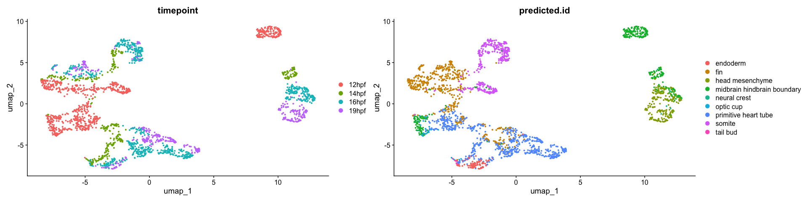<!-- -->

The primitive heart tube cluster contains the pericardium and myocardium
cells

``` r
p.unint[["peri"]] <- DimPlot(Lange_sub, cells.highlight = peri_cells, raster=FALSE) + 
  NoLegend() + ggtitle("pericardium cells")
p.unint[["pecfin"]] <- DimPlot(Lange_sub, cells.highlight = pecfin_cells, raster=FALSE) + 
  NoLegend() + ggtitle("pectoral fin cells")
p.unint[["parch1"]] <- DimPlot(Lange_sub, cells.highlight = parch1_cells, raster=FALSE) + 
  NoLegend() + ggtitle("pharyngeal arch 1 cells")
#p.unint[["parch2"]] <- DimPlot(Lange_sub, cells.highlight = parch2_cells, raster=FALSE) + 
#  NoLegend() + ggtitle("parch2 cells")
p.unint[["cardio"]] <- DimPlot(Lange_sub, cells.highlight = cardio_cells, raster=FALSE) + 
  NoLegend() + ggtitle("myocardium cells")
p.latmeso <- wrap_plots(p.unint)
p.latmeso
```

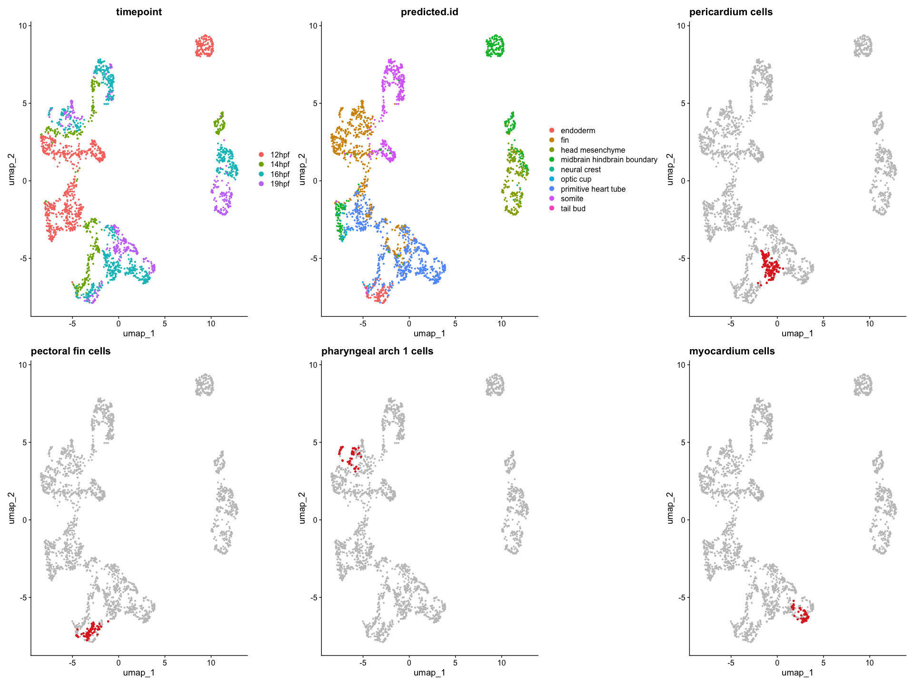<!-- -->

``` r
#ggsave(filename = "results/Lange_full_UMAP.png", plot = p, width = 10, height = 5)
```

## 3.3 subset primitive heart tube cells

``` r
Idents(Lange_sub) <- "predicted.id"
Lange_sub2 <- subset(Lange_sub, idents = "primitive heart tube")
DimPlot(Lange_sub2)
```

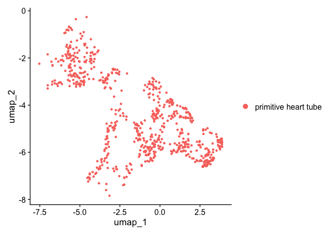<!-- -->

``` r
Lange_sub2 <- NormalizeData(Lange_sub2)
```

    ## Normalizing layer: counts.12hpf

    ## Normalizing layer: counts.14hpf

    ## Normalizing layer: counts.16hpf

    ## Normalizing layer: counts.19hpf

``` r
Lange_sub2 <- FindVariableFeatures(Lange_sub2)
```

    ## Finding variable features for layer counts.12hpf

    ## Finding variable features for layer counts.14hpf

    ## Finding variable features for layer counts.16hpf

    ## Finding variable features for layer counts.19hpf

``` r
Lange_sub2 <- ScaleData(Lange_sub2)
```

    ## Centering and scaling data matrix

    ## Warning: Different features in new layer data than already exists for
    ## scale.data

``` r
Lange_sub2 <- RunPCA(Lange_sub2)
```

    ## PC_ 1 
    ## Positive:  myl7, rbfox1l, tnni1b, smtnl1, ryr2b, cmlc1, tnnt2a, atp2a2a, ttn.1, desma 
    ##     tnnc1a, actc1a, nexn, ccdc141, myh7, unc45b, ablim1b, si:ch211-131k2.3, lmo7a, cacna1g 
    ##     mylk3, dub, hapln1a, podxl, zgc:92429, txlnba, tpm4a, alpk3a, klhl31, prkag2a 
    ## Negative:  cbx3a, cbx1a, anp32b, pcna, npm1a, fbl, seta, ppm1g, snu13b, setb 
    ##     stmn1a, nhp2, dkc1, ncl, nop56, chaf1a, nop58, prmt1, sumo3b, cbx5 
    ##     parp1, cx43.4, ranbp1, rbbp4, gnl3, ssrp1a, nop2, lyar, si:ch211-222l21.1, selenoh 
    ## PC_ 2 
    ## Positive:  si:ch211-152c2.3, ucp2, ribc1, stm, nrp1a, hspb1, hand2, fn1a, tjp1b, ved 
    ##     rbpms2a, tbx3a, tbx20, arl4d, apoc1, hapln1b, nid1b, bmper, bckdk, h2ax1 
    ##     adgrl2a, ppp1r14c, fthl27, cited4b, crabp2b, zic2b, sp5l, inka1b, serinc5, cdx4 
    ## Negative:  nme2b.1, si:ch211-286o17.1, rpl23a, fabp3, pcolcea, rpl22, rpl35a, bnc2, rplp1, rpl39 
    ##     rpl31, rps15, si:dkey-151g10.6, rps29, rpl36a, zgc:171772, uba52, rpl35, rpl36, rps12 
    ##     rps24, rpl37-1, rpl32, rpl34, rplp2l, rps25, rps15a, rps26l, rps28, rpl23 
    ## PC_ 3 
    ## Positive:  cdca7a, hells, mcm3, bzw1b, orc6, mcm2, mcm5, serbp1a, casp8ap2, mcm6 
    ##     eef1b2, mcm4, cdca7b, gmnn, mt-nd1, si:ch73-281n10.2, npm1a, mt-co2, ccng1, si:dkey-42i9.4 
    ##     ran, actb2, mt-co3, mt-cyb, snu13b, prmt1, fthl27, eif4ebp3l, rif1, nme2b.1 
    ## Negative:  si:ch1073-153i20.5, hist1h2a6, FQ312024.1, si:ch211-113a14.19-2, hist1h4l-16, hist1h2a3-1, hist1h2a11-1, si:dkey-261m9.12, si:ch211-113a14.18, zgc:173552 
    ##     hist1h2a1, si:dkey-108k21.10, hist1h4l-14, hist1h2a5, si:ch1073-153i20.4, hist1h2a11-4, hist1h4l-9, ano9a-1, hist1h4l-10, si:ch211-113a14.24 
    ##     hist2h3c, zgc:173552-3, hist1h4l-6, hist1h2a2, zgc:153405, hist1h2a11-3, hist1h4l-23, zgc:173552-5, CR762436.2, si:ch73-36p18.1 
    ## PC_ 4 
    ## Positive:  mtus1a, vcana, hdac9b, cx36.7, myh7l, hspb7, tnnc1a, obsl1a, has2, tmem38a 
    ##     fhl2a, dld, mybpc3, kif26ba, alpk2, osr1, apobec2a, rpl23, rps15a, cxcl12a 
    ##     rplp1, rps25, rplp2l, dhrs3a, lmo7a, atp5f1e, rps26l, rpl32, hoxb6a, si:ch73-281n10.2 
    ## Negative:  akap12b, bmp6, itga4, pmp22b, llgl1, pdgfra, tubb5, vat1, klf6a, cav1 
    ##     hyal2a, pls3, esyt2b, fzd7a, dlc1, bambib, cnn2, lurap1, pdlim1, emp2 
    ##     alcamb, bambia, crybg1a, actb2, vox, mab21l2, msx1b, cav2, zgc:114045, rap1b 
    ## PC_ 5 
    ## Positive:  emilin2b, si:ch211-199g17.2, sema3e, eva1a, hoxc3a, fosab, hs3st3b1b, hoxd9a, hoxc6b, cldng 
    ##     snai2, msx3, her15.1, hoxc8a, fbln1, egr1, BX005254.4, hoxa9b, farp2, hoxb7a 
    ##     hoxb10a, hoxb9a, mllt3, hoxc9a, junbb, junba, eva1bb, hoxd3a, elovl6, boc 
    ## Negative:  cracr2b, kif26ab, si:ch73-281n10.2, hmgb2b, qkia, serpinh1b, myoc, hmgb2a, rbpms2a, si:dkey-261h17.1 
    ##     si:ch211-250c4.4, h3f3b.1, dynll1, nkx2.7, gata6, hspb1, tjp1b, ttn.2, rdh10a, si:ch211-222l21.1 
    ##     ran, alcama, hapln1b, nkx2.5, actc1a-1, cnn3a, bambib, sept9a, gata5, npm1a

``` r
Lange_sub2 <- FindNeighbors(Lange_sub2, dims = 1:30, reduction = "pca")
```

    ## Computing nearest neighbor graph

    ## Computing SNN

``` r
Lange_sub2 <- FindClusters(Lange_sub2, cluster.name = "unintegrated_clusters")
```

    ## Modularity Optimizer version 1.3.0 by Ludo Waltman and Nees Jan van Eck
    ## 
    ## Number of nodes: 675
    ## Number of edges: 19992
    ## 
    ## Running Louvain algorithm...
    ## Maximum modularity in 10 random starts: 0.7425
    ## Number of communities: 8
    ## Elapsed time: 0 seconds

``` r
Lange_sub2 <- RunUMAP(Lange_sub2, dims = 1:30, reduction = "pca")
```

    ## 17:09:15 UMAP embedding parameters a = 0.9922 b = 1.112

    ## 17:09:15 Read 675 rows and found 30 numeric columns

    ## 17:09:15 Using Annoy for neighbor search, n_neighbors = 30

    ## 17:09:15 Building Annoy index with metric = cosine, n_trees = 50

    ## 0%   10   20   30   40   50   60   70   80   90   100%

    ## [----|----|----|----|----|----|----|----|----|----|

    ## **************************************************|
    ## 17:09:15 Writing NN index file to temp file /var/folders/pz/z8hs91417hl_gzxjrv4pmvyw0000gp/T//RtmpECmCwu/fileaf92292dc80f
    ## 17:09:15 Searching Annoy index using 1 thread, search_k = 3000
    ## 17:09:15 Annoy recall = 100%
    ## 17:09:15 Commencing smooth kNN distance calibration using 1 thread with target n_neighbors = 30
    ## 17:09:16 Initializing from normalized Laplacian + noise (using RSpectra)
    ## 17:09:16 Commencing optimization for 500 epochs, with 24066 positive edges
    ## 17:09:17 Optimization finished

``` r
p.unint <- DimPlot(Lange_sub2, group.by = c("timepoint", "predicted.id", "unintegrated_clusters"), combine = F)
wrap_plots(p.unint)
```

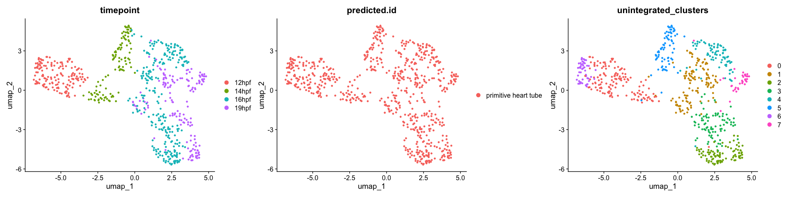<!-- -->

``` r
p.unint[["peri"]] <- DimPlot(Lange_sub2, cells.highlight = peri_cells, raster=FALSE) + 
  NoLegend() + ggtitle("pericardium cells")
p.unint[["pecfin"]] <- DimPlot(Lange_sub2, cells.highlight = pecfin_cells, raster=FALSE) + 
  NoLegend() + ggtitle("pecfin cells")
p.unint[["parch1"]] <- DimPlot(Lange_sub2, cells.highlight = parch1_cells, raster=FALSE) + 
  NoLegend() + ggtitle("parch1 cells")
p.unint[["parch2"]] <- DimPlot(Lange_sub2, cells.highlight = parch2_cells, raster=FALSE) + 
  NoLegend() + ggtitle("parch2 cells")
p.unint[["cardio"]] <- DimPlot(Lange_sub2, cells.highlight = cardio_cells, raster=FALSE) + 
  NoLegend() + ggtitle("cardio cells")
wrap_plots(p.unint)
```

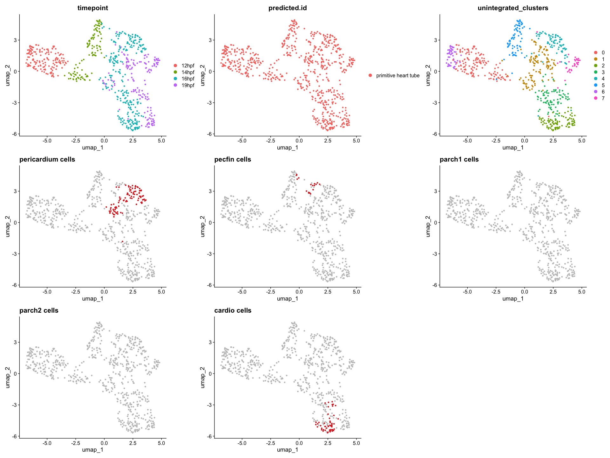<!-- -->

``` r
#ggsave(filename = "results/Lange_full_UMAP.png", plot = p, width = 10, height = 5)
```

## 3.4 ID primitive heart tube subset clusters

use 3 previously annotated datasets to help ID cells in the Lange
primitive heart tube subset.

``` r
cardio.anchors <- FindTransferAnchors(reference = cardio, query = Lange_sub2, dims = 1:30,
    reference.reduction = "pca")
```

    ## Projecting cell embeddings

    ## Finding neighborhoods

    ## Finding anchors

    ##  Found 466 anchors

    ## Finding neighborhoods

    ## Finding anchors

    ##  Found 396 anchors

    ## Finding neighborhoods

    ## Finding anchors

    ##  Found 910 anchors

    ## Finding neighborhoods

    ## Finding anchors

    ##  Found 524 anchors

``` r
cardio.predictions <- TransferData(anchorset = cardio.anchors, refdata = cardio$named_mnn_clusters, dims = 1:30)
```

    ## Finding integration vectors

    ## Finding integration vector weights

    ## Predicting cell labels

``` r
Lange_sub2 <- AddMetaData(Lange_sub2, metadata = cardio.predictions)
```

keep predicted.id as predicted.id.cardio

``` r
Lange_sub2$predicted.id.cardio <- Lange_sub2$predicted.id
```

``` r
lat_meso2 <- readRDS(file = "~/Documents/Projects/Mosimann/Seurat_V5/RDSfiles/lat_meso2.RDS")
```

``` r
latmes.anchors <- FindTransferAnchors(reference = lat_meso2, query = Lange_sub2, dims = 1:30,
    reference.reduction = "pca")
```

    ## Projecting cell embeddings

    ## Finding neighborhoods

    ## Finding anchors

    ##  Found 210 anchors

    ## Finding neighborhoods

    ## Finding anchors

    ##  Found 220 anchors

    ## Finding neighborhoods

    ## Finding anchors

    ##  Found 359 anchors

    ## Finding neighborhoods

    ## Finding anchors

    ##  Found 170 anchors

``` r
latmes.predictions <- TransferData(anchorset = latmes.anchors, refdata = lat_meso2$subset_clusters, dims = 1:30)
```

    ## Finding integration vectors

    ## Finding integration vector weights

    ## Predicting cell labels

``` r
Lange_sub2 <- AddMetaData(Lange_sub2, metadata = latmes.predictions)
```

keep predicted.id as predicted.id.latmeso

``` r
Lange_sub2$predicted.id.latmeso <- Lange_sub2$predicted.id
```

``` r
Moran <- readRDS(file = "~/Documents/Projects/Mosimann/Hannah_scRNAseq_github/notebooks/RDSfiles/hand2.bud.clustered.RDS")
DimPlot(Moran, group.by = "sub.cluster") + scale_color_igv()
```

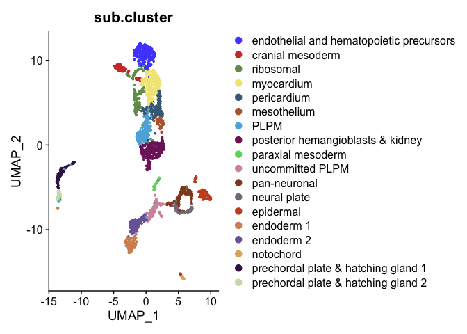<!-- -->

``` r
moran.anchors <- FindTransferAnchors(reference = Moran, query = Lange_sub2, dims = 1:30,
    reference.reduction = "pca")
```

    ## Projecting cell embeddings

    ## Finding neighborhoods

    ## Finding anchors

    ##  Found 445 anchors

    ## Finding neighborhoods

    ## Finding anchors

    ##  Found 342 anchors

    ## Finding neighborhoods

    ## Finding anchors

    ##  Found 411 anchors

    ## Finding neighborhoods

    ## Finding anchors

    ##  Found 278 anchors

``` r
moran.predictions <- TransferData(anchorset = moran.anchors, refdata = Moran$sub.cluster, dims = 1:30)
```

    ## Finding integration vectors

    ## Finding integration vector weights

    ## Predicting cell labels

``` r
Lange_sub2 <- AddMetaData(Lange_sub2, metadata = moran.predictions)
```

These plots show the predicted ID’s of the cells based on various
datasets.

predicted.id = predictions based on our full scRNA-seq

predicted.id.latmeso = predictions based on the previous Fig2 slingshot
dataset

predicted.id.cardio = predictions based on the cardio subset of our
scRNA-seq integrated with the Lange 16hpf and 24hpf datasets

``` r
DimPlot(Lange_sub2, 
        group.by = c("unintegrated_clusters","predicted.id",
                     "predicted.id.latmeso","predicted.id.cardio","timepoint"))
```

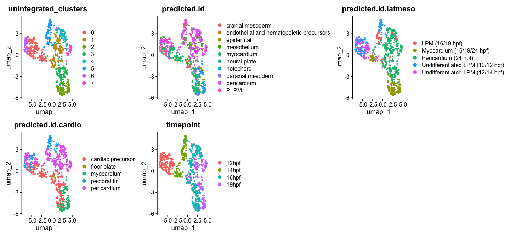<!-- -->

Cluster names

``` r
Idents(Lange_sub2) <- "unintegrated_clusters"
Lange_sub2 <- RenameIdents(Lange_sub2,
                           "0" = "Undifferentiated LPM (12/14 hpf)",
                           "1" = "Mixed Pericardium/Mycocardium (16/19 hpf)",
                           "2" = "Myocardium 1 (16/19 hpf)",
                           "3" = "Myocardium 2 (16/19 hpf)",
                           "4" = "Pericardium (16 hpf)",
                           "5" = "LPM (14 hpf)",
                           "6" = "Undifferentiated LPM (12 hpf)",
                           "7" = "Pericardium (19 hpf)")
Lange_sub2$Clusters <- Idents(Lange_sub2)
```

``` r
DimPlot(Lange_sub2, group.by = "Clusters")
```

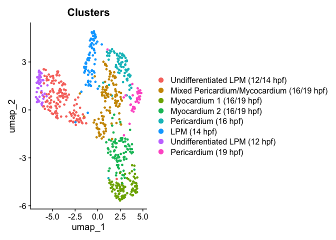<!-- -->

## 3.5 Pericardium DE genes

These are the DE genes expressed in Pericardium 16 & 19hpf over
Myocardium 1 (16/19 hpf)

``` r
Lange_sub2 <- JoinLayers(Lange_sub2)
Idents(Lange_sub2) <- "Clusters"
PeriVsMyo.markers <- FindMarkers(Lange_sub2, ident.1 = c("Pericardium (16 hpf)","Pericardium (19 hpf)"),
                            ident.2 = c("Myocardium 1 (16/19 hpf)"), only.pos = T)
head(PeriVsMyo.markers, 20)
```

    ##                  p_val avg_log2FC pct.1 pct.2    p_val_adj
    ## mycn      1.007842e-32  3.7196096 0.974 0.261 3.231140e-28
    ## eif4ebp3l 3.398327e-29  2.2619321 0.982 0.478 1.089504e-24
    ## hoxb3a    9.190223e-29  1.7859056 1.000 0.609 2.946386e-24
    ## twist1a   2.861958e-28  5.7044819 0.860 0.087 9.175437e-24
    ## marcksl1b 4.731355e-28  1.4143119 1.000 0.924 1.516872e-23
    ## prmt1     1.086729e-27  1.0116002 1.000 0.946 3.484054e-23
    ## dkc1      1.300471e-27  1.3457540 1.000 0.826 4.169309e-23
    ## mcm6      9.818368e-27  2.1342051 0.974 0.522 3.147769e-22
    ## npm1a     1.853497e-26  0.7553122 1.000 1.000 5.942311e-22
    ## fbl       2.442547e-26  0.9616764 1.000 0.935 7.830806e-22
    ## marcksb   3.391629e-26  0.6462032 1.000 0.989 1.087356e-21
    ## cdh11     3.622433e-26  2.1399462 0.982 0.489 1.161352e-21
    ## dhrs3a    4.580272e-26  7.3218371 0.772 0.000 1.468435e-21
    ## snu13b    5.593805e-26  0.9112916 1.000 0.946 1.793374e-21
    ## mcm3      1.125254e-25  2.3473542 0.965 0.413 3.607563e-21
    ## gnl3      1.438677e-25  1.3071407 1.000 0.750 4.612398e-21
    ## nme2b.1   1.553150e-25  0.4661479 1.000 1.000 4.979398e-21
    ## rsl1d1    1.650131e-25  1.1686093 1.000 0.859 5.290321e-21
    ## ppan      1.671841e-25  1.3888934 1.000 0.783 5.359923e-21
    ## nop56     1.893300e-25  0.8239986 1.000 0.989 6.069921e-21

These are the DE genes in Pericardium 16 hpf and 19hpf over all other
primitive heart tube cells

``` r
Peri.markers <- FindMarkers(Lange_sub2, ident.1 = c("Pericardium (16 hpf)","Pericardium (19 hpf)"),
                            only.pos = T)
head(Peri.markers, 20)
```

    ##                 p_val avg_log2FC pct.1 pct.2    p_val_adj
    ## fabp3    4.121649e-39  1.1691029 0.991 0.854 1.321401e-34
    ## nme2b.1  1.098466e-37  0.4070589 1.000 1.000 3.521683e-33
    ## eef2b    1.020704e-36  0.1930731 1.000 1.000 3.272377e-32
    ## serbp1a  2.341262e-33  0.1891252 1.000 1.000 7.506086e-29
    ## nr2f2    9.651020e-32  1.8043408 0.842 0.280 3.094117e-27
    ## eef1b2   4.818337e-29  0.2788996 1.000 1.000 1.544759e-24
    ## hoxa4a   3.031719e-28  1.8127510 0.798 0.307 9.719690e-24
    ## hsp90ab1 6.589913e-28  0.1450609 1.000 1.000 2.112726e-23
    ## eif5a2   1.957421e-27  0.1963231 1.000 1.000 6.275492e-23
    ## gstm.1   2.362550e-26  0.9425882 0.991 0.841 7.574337e-22
    ## pcolcea  3.913279e-26  1.1548137 0.991 0.674 1.254597e-21
    ## alx4a    1.670777e-25  2.3979152 0.579 0.160 5.356511e-21
    ## rpl23a   3.137469e-25  0.2118554 1.000 1.000 1.005873e-20
    ## hoxc1a   2.522675e-24  1.9619921 0.684 0.239 8.087697e-20
    ## fgfr3    7.775056e-24  1.2525282 0.912 0.599 2.492683e-19
    ## rpl18    1.145354e-23  0.1955061 1.000 1.000 3.672004e-19
    ## rps29    1.479155e-23  0.2075295 1.000 1.000 4.742171e-19
    ## bnc2     1.584841e-23  1.4570353 0.860 0.414 5.080999e-19
    ## hspe1    1.941453e-23  0.6993522 0.991 0.963 6.224298e-19
    ## rpl4     1.991830e-23  0.2164691 1.000 1.000 6.385807e-19

These are the DE genes comparing Pericardium 16hpf & 19hpf to Myocardium
1 (16/19 hpf)

``` r
FeaturePlot(Lange_sub2, features = rownames(head(PeriVsMyo.markers,10)), ncol = 4)
```

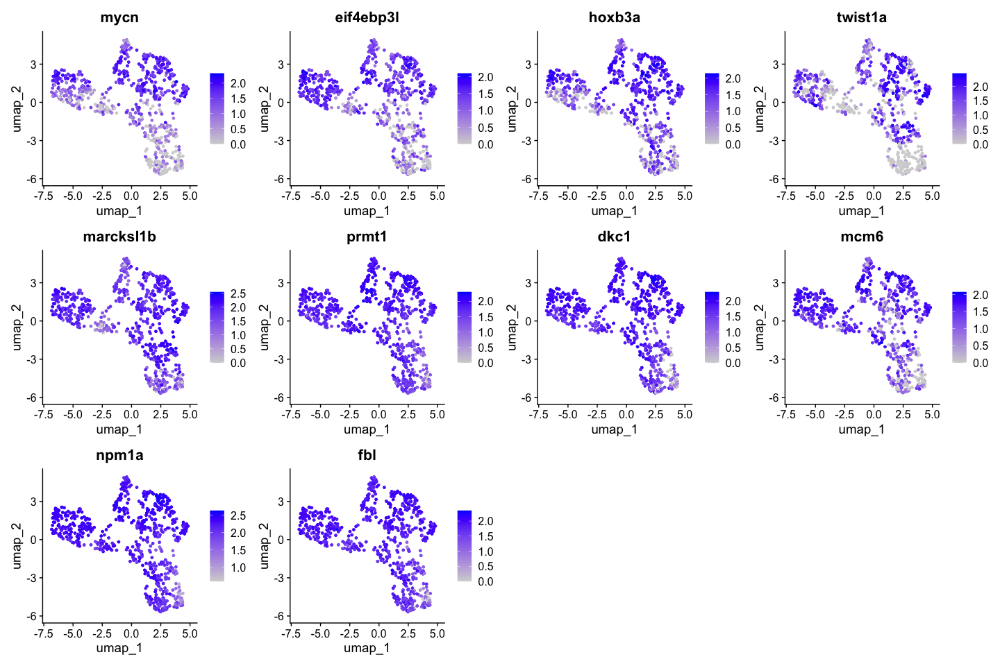<!-- -->
these are the DE genes comparing Pericardium 16 & 19 hpf to all other
primitive heart tube cells

``` r
FeaturePlot(Lange_sub2, features = rownames(head(Peri.markers,10)), ncol = 4)
```

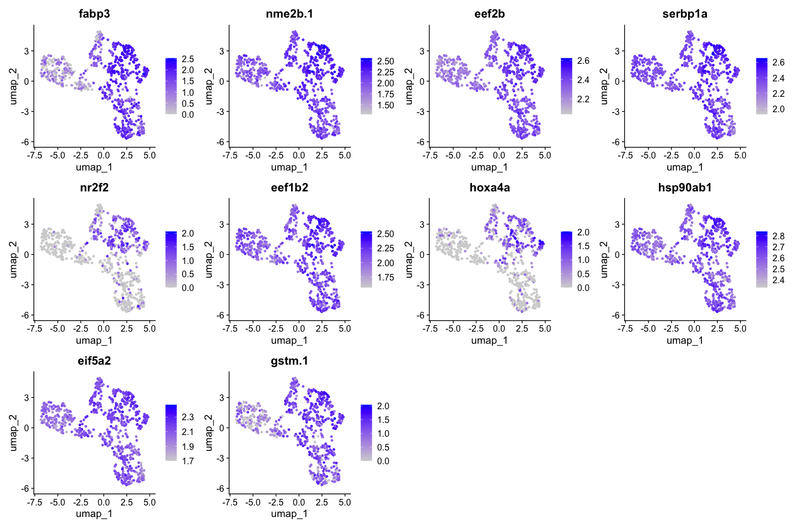<!-- -->

## 3.6 Feature plots for primitive heart tube subset

``` r
genelist <- c("meis3","jam2b", "sfrp5", "tmem88b", "nr2f1a", "meis2b", "twist1a",
              "tbx20", "mef2ca", "hey2", "actn2b","ttn.2", "nkx2.5")
```

``` r
p <- FeaturePlot(Lange_sub2, features = genelist, ncol = 4)
```

    ## Warning: The following requested variables were not found: meis2b

``` r
p
```

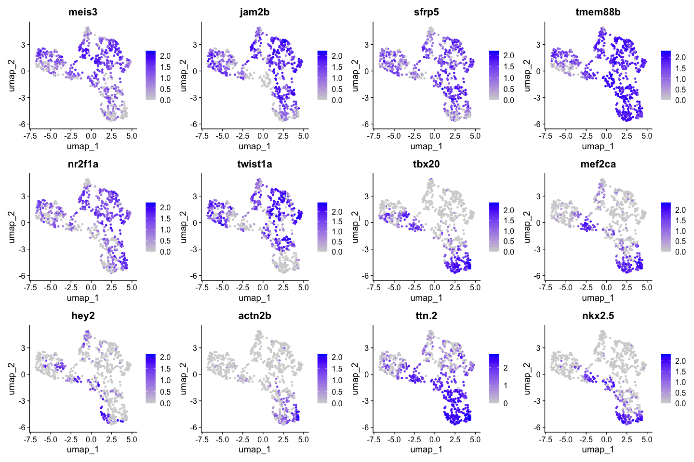<!-- -->

``` r
ggsave(filename = "results/FeaturePlots_umap.png", plot = p, width = 15, height = 10)
```

in PC map rather than umap

``` r
p <- FeaturePlot(Lange_sub2, features = genelist, ncol = 4, reduction = "pca")
```

    ## Warning: The following requested variables were not found: meis2b

``` r
p
```

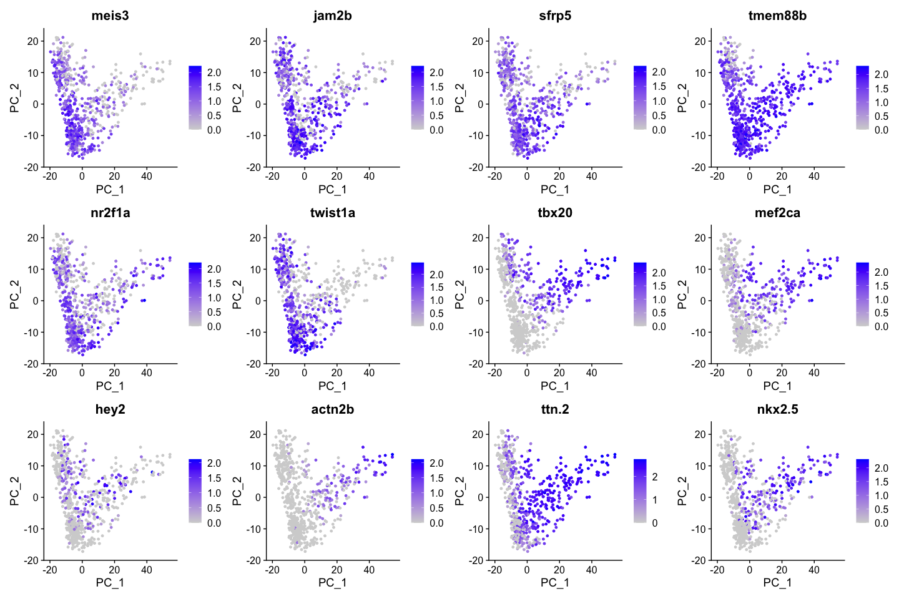<!-- -->

``` r
ggsave(filename = "results/FeaturePlots_pca.png", plot = p, width = 15, height = 10)
```

Prepare object for slingshot

``` r
Idents(Lange_sub2) <- "Clusters"
Lange_sub2[['RNA']] <- as(object = Lange_sub2[["RNA"]], Class = "Assay")
```

    ## Warning: Assay RNA changing from Assay5 to Assay

``` r
sce <- as.SingleCellExperiment(Lange_sub2, assay = 'RNA')
```

``` r
p.primht <- DimPlot(Lange_sub2, reduction = "umap")
p.primht
```

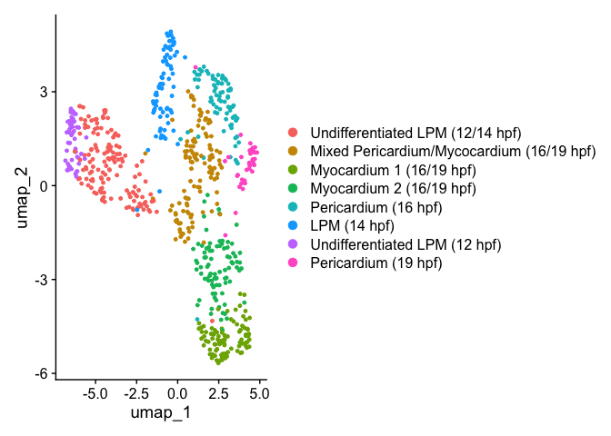<!-- -->

``` r
p.pca <- DimPlot(Lange_sub2, reduction = "pca", group.by = c("timepoint","Clusters"))
p.pca
```

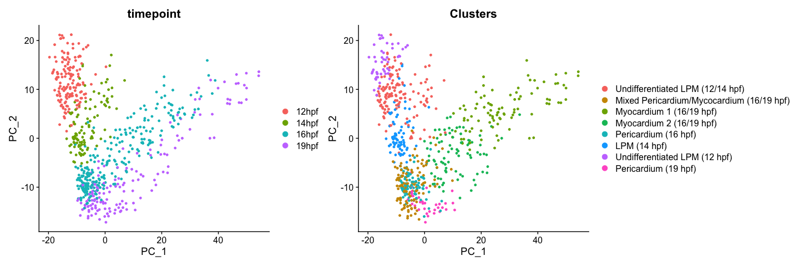<!-- -->

``` r
layout <- "
AAABBB
CCDDEE
FFGGHH
IIJJJJ
"
p.comb <- free(p.langefull) + p.peri.full +
  p.latmeso[[1]] + p.latmeso[[3]] + p.latmeso[[4]] + 
             p.latmeso[[2]] + p.latmeso[[5]] + p.latmeso[[6]] +
             p.primht + p.pca +
             plot_layout(design = layout) + plot_annotation(tag_levels =
                                                              list(c("A","B","C","E","","D","","","F","G","")))
p.comb
```

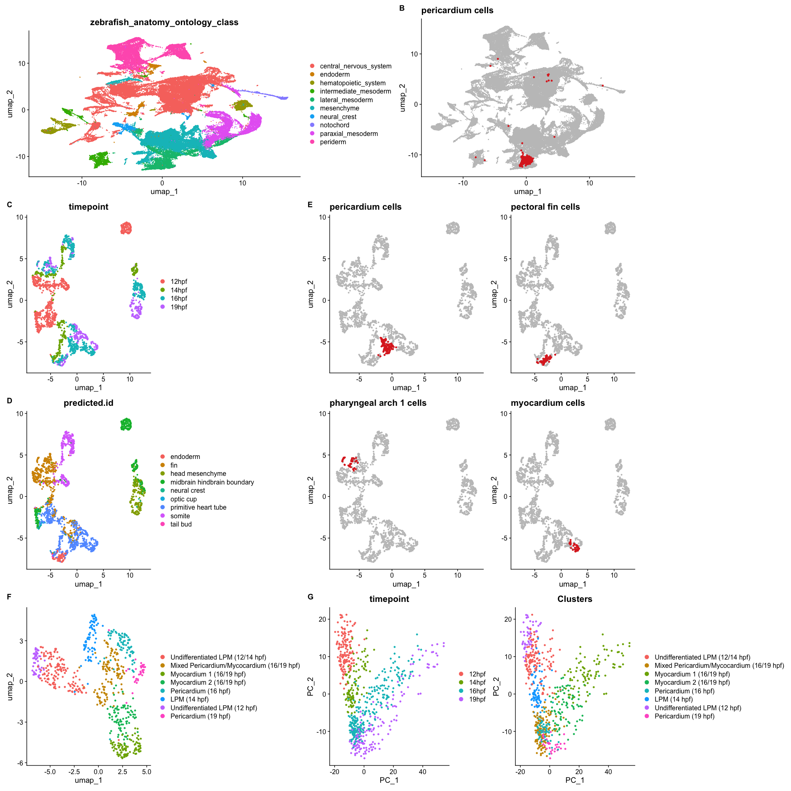<!-- -->

``` r
ggsave(filename = "results/Supp_Lange_subset.png", plot = p.comb, width = 20, height = 20)
```

# 4. Slingshot pseudotime lineages

``` r
library(slingshot)
```

    ## Warning: package 'slingshot' was built under R version 4.3.1

    ## Loading required package: princurve

    ## Loading required package: TrajectoryUtils

    ## Warning: package 'TrajectoryUtils' was built under R version 4.3.2

    ## Loading required package: SingleCellExperiment

    ## Warning: package 'SingleCellExperiment' was built under R version 4.3.1

    ## Loading required package: SummarizedExperiment

    ## Warning: package 'SummarizedExperiment' was built under R version 4.3.1

    ## Loading required package: MatrixGenerics

    ## Warning: package 'MatrixGenerics' was built under R version 4.3.1

    ## Loading required package: matrixStats

    ## Warning: package 'matrixStats' was built under R version 4.3.2

    ## 
    ## Attaching package: 'matrixStats'

    ## The following object is masked from 'package:dplyr':
    ## 
    ##     count

    ## 
    ## Attaching package: 'MatrixGenerics'

    ## The following objects are masked from 'package:matrixStats':
    ## 
    ##     colAlls, colAnyNAs, colAnys, colAvgsPerRowSet, colCollapse,
    ##     colCounts, colCummaxs, colCummins, colCumprods, colCumsums,
    ##     colDiffs, colIQRDiffs, colIQRs, colLogSumExps, colMadDiffs,
    ##     colMads, colMaxs, colMeans2, colMedians, colMins, colOrderStats,
    ##     colProds, colQuantiles, colRanges, colRanks, colSdDiffs, colSds,
    ##     colSums2, colTabulates, colVarDiffs, colVars, colWeightedMads,
    ##     colWeightedMeans, colWeightedMedians, colWeightedSds,
    ##     colWeightedVars, rowAlls, rowAnyNAs, rowAnys, rowAvgsPerColSet,
    ##     rowCollapse, rowCounts, rowCummaxs, rowCummins, rowCumprods,
    ##     rowCumsums, rowDiffs, rowIQRDiffs, rowIQRs, rowLogSumExps,
    ##     rowMadDiffs, rowMads, rowMaxs, rowMeans2, rowMedians, rowMins,
    ##     rowOrderStats, rowProds, rowQuantiles, rowRanges, rowRanks,
    ##     rowSdDiffs, rowSds, rowSums2, rowTabulates, rowVarDiffs, rowVars,
    ##     rowWeightedMads, rowWeightedMeans, rowWeightedMedians,
    ##     rowWeightedSds, rowWeightedVars

    ## Loading required package: GenomicRanges

    ## Warning: package 'GenomicRanges' was built under R version 4.3.1

    ## Loading required package: stats4

    ## Loading required package: BiocGenerics

    ## Warning: package 'BiocGenerics' was built under R version 4.3.1

    ## 
    ## Attaching package: 'BiocGenerics'

    ## The following objects are masked from 'package:dplyr':
    ## 
    ##     combine, intersect, setdiff, union

    ## The following object is masked from 'package:SeuratObject':
    ## 
    ##     intersect

    ## The following objects are masked from 'package:stats':
    ## 
    ##     IQR, mad, sd, var, xtabs

    ## The following objects are masked from 'package:base':
    ## 
    ##     anyDuplicated, aperm, append, as.data.frame, basename, cbind,
    ##     colnames, dirname, do.call, duplicated, eval, evalq, Filter, Find,
    ##     get, grep, grepl, intersect, is.unsorted, lapply, Map, mapply,
    ##     match, mget, order, paste, pmax, pmax.int, pmin, pmin.int,
    ##     Position, rank, rbind, Reduce, rownames, sapply, setdiff, sort,
    ##     table, tapply, union, unique, unsplit, which.max, which.min

    ## Loading required package: S4Vectors

    ## Warning: package 'S4Vectors' was built under R version 4.3.2

    ## 
    ## Attaching package: 'S4Vectors'

    ## The following objects are masked from 'package:dplyr':
    ## 
    ##     first, rename

    ## The following object is masked from 'package:utils':
    ## 
    ##     findMatches

    ## The following objects are masked from 'package:base':
    ## 
    ##     expand.grid, I, unname

    ## Loading required package: IRanges

    ## Warning: package 'IRanges' was built under R version 4.3.1

    ## 
    ## Attaching package: 'IRanges'

    ## The following objects are masked from 'package:dplyr':
    ## 
    ##     collapse, desc, slice

    ## The following object is masked from 'package:sp':
    ## 
    ##     %over%

    ## Loading required package: GenomeInfoDb

    ## Warning: package 'GenomeInfoDb' was built under R version 4.3.3

    ## Loading required package: Biobase

    ## Warning: package 'Biobase' was built under R version 4.3.1

    ## Welcome to Bioconductor
    ## 
    ##     Vignettes contain introductory material; view with
    ##     'browseVignettes()'. To cite Bioconductor, see
    ##     'citation("Biobase")', and for packages 'citation("pkgname")'.

    ## 
    ## Attaching package: 'Biobase'

    ## The following object is masked from 'package:MatrixGenerics':
    ## 
    ##     rowMedians

    ## The following objects are masked from 'package:matrixStats':
    ## 
    ##     anyMissing, rowMedians

    ## 
    ## Attaching package: 'SummarizedExperiment'

    ## The following object is masked from 'package:Seurat':
    ## 
    ##     Assays

    ## The following object is masked from 'package:SeuratObject':
    ## 
    ##     Assays

``` r
library(tradeSeq)
```

    ## Warning: package 'tradeSeq' was built under R version 4.3.1

``` r
crv <- slingshot(sce, reducedDim = 'PCA', 
                 clusterLabels = colData(sce)$Clusters,
                 start.clus = 'Undifferentiated LPM (12 hpf)')
```

``` r
crv@colData@listData[["slingshot"]]@metadata[["lineages"]][["Lineage1"]]
```

    ## [1] "Undifferentiated LPM (12 hpf)"            
    ## [2] "Undifferentiated LPM (12/14 hpf)"         
    ## [3] "LPM (14 hpf)"                             
    ## [4] "Mixed Pericardium/Mycocardium (16/19 hpf)"
    ## [5] "Myocardium 2 (16/19 hpf)"                 
    ## [6] "Myocardium 1 (16/19 hpf)"

``` r
crv@colData@listData[["slingshot"]]@metadata[["lineages"]][["Lineage2"]]
```

    ## [1] "Undifferentiated LPM (12 hpf)"            
    ## [2] "Undifferentiated LPM (12/14 hpf)"         
    ## [3] "LPM (14 hpf)"                             
    ## [4] "Mixed Pericardium/Mycocardium (16/19 hpf)"
    ## [5] "Pericardium (16 hpf)"

``` r
crv@colData@listData[["slingshot"]]@metadata[["lineages"]][["Lineage3"]]
```

    ## [1] "Undifferentiated LPM (12 hpf)"            
    ## [2] "Undifferentiated LPM (12/14 hpf)"         
    ## [3] "LPM (14 hpf)"                             
    ## [4] "Mixed Pericardium/Mycocardium (16/19 hpf)"
    ## [5] "Pericardium (19 hpf)"

``` r
crv@colData@listData[["slingshot"]]@metadata[["lineages"]][["Lineage4"]]
```

    ## NULL

``` r
crv@colData@listData[["slingshot"]]@metadata[["lineages"]][["Lineage5"]]
```

    ## NULL

Final slingshot pseudotime trajectories showing one trajectory going to
Myocardium, one to Pericardium 16hpf and one to Pericardium 19hpf

``` r
p <- plotGeneCount(crv, clusters = colData(sce)$Clusters) #+ 
  #scale_color_manual(values = c("#00BF7D","#E76BF3","#00B0F6","#F8766D","#A3A500"))
p
```

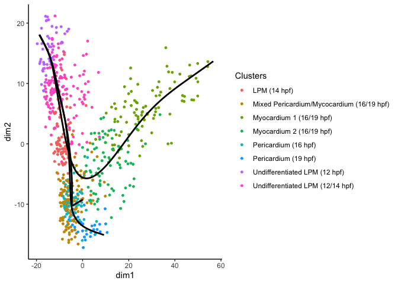<!-- -->

``` r
ggsave(filename = "results/Fig2_Lange_slingshot.png")
```

    ## Saving 7 x 5 in image

``` r
p <- FeaturePlot(Lange_sub2, features = c("jam2b","twist1a","sfrp5","tbx20","nkx2.5","actn2b"), reduction = "pca")
p
```

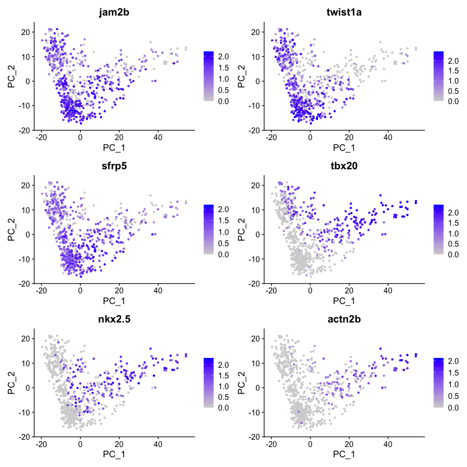<!-- -->

``` r
ggsave(filename = "results/Fig2_pca_featurePlots.png", plot = p, width = 10, height = 10)
```

``` r
sessionInfo()
```

    ## R version 4.3.0 (2023-04-21)
    ## Platform: x86_64-apple-darwin20 (64-bit)
    ## Running under: macOS Monterey 12.6.2
    ## 
    ## Matrix products: default
    ## BLAS:   /Library/Frameworks/R.framework/Versions/4.3-x86_64/Resources/lib/libRblas.0.dylib 
    ## LAPACK: /Library/Frameworks/R.framework/Versions/4.3-x86_64/Resources/lib/libRlapack.dylib;  LAPACK version 3.11.0
    ## 
    ## locale:
    ## [1] en_US.UTF-8/en_US.UTF-8/en_US.UTF-8/C/en_US.UTF-8/en_US.UTF-8
    ## 
    ## time zone: America/Denver
    ## tzcode source: internal
    ## 
    ## attached base packages:
    ## [1] stats4    stats     graphics  grDevices utils     datasets  methods  
    ## [8] base     
    ## 
    ## other attached packages:
    ##  [1] tradeSeq_1.16.0             slingshot_2.10.0           
    ##  [3] TrajectoryUtils_1.10.1      SingleCellExperiment_1.24.0
    ##  [5] SummarizedExperiment_1.32.0 Biobase_2.62.0             
    ##  [7] GenomicRanges_1.54.1        GenomeInfoDb_1.38.8        
    ##  [9] IRanges_2.36.0              S4Vectors_0.40.2           
    ## [11] BiocGenerics_0.48.1         MatrixGenerics_1.14.0      
    ## [13] matrixStats_1.3.0           princurve_2.1.6            
    ## [15] patchwork_1.2.0             ggsci_3.0.3                
    ## [17] ggplot2_3.5.0               dplyr_1.1.4                
    ## [19] Seurat_5.0.3                SeuratObject_5.0.1         
    ## [21] sp_2.1-3                   
    ## 
    ## loaded via a namespace (and not attached):
    ##   [1] RcppAnnoy_0.0.22          splines_4.3.0            
    ##   [3] later_1.3.2               bitops_1.0-7             
    ##   [5] tibble_3.2.1              polyclip_1.10-6          
    ##   [7] fastDummies_1.7.3         lifecycle_1.0.4          
    ##   [9] edgeR_4.0.16              globals_0.16.3           
    ##  [11] lattice_0.22-6            MASS_7.3-60.0.1          
    ##  [13] magrittr_2.0.3            limma_3.58.1             
    ##  [15] plotly_4.10.4             rmarkdown_2.26           
    ##  [17] yaml_2.3.8                httpuv_1.6.15            
    ##  [19] sctransform_0.4.1         spam_2.10-0              
    ##  [21] spatstat.sparse_3.0-3     reticulate_1.35.0        
    ##  [23] cowplot_1.1.3             pbapply_1.7-2            
    ##  [25] RColorBrewer_1.1-3        abind_1.4-5              
    ##  [27] zlibbioc_1.48.2           Rtsne_0.17               
    ##  [29] purrr_1.0.2               presto_1.0.0             
    ##  [31] RCurl_1.98-1.14           GenomeInfoDbData_1.2.11  
    ##  [33] ggrepel_0.9.5             irlba_2.3.5.1            
    ##  [35] listenv_0.9.1             spatstat.utils_3.1-0     
    ##  [37] goftest_1.2-3             RSpectra_0.16-1          
    ##  [39] spatstat.random_3.2-3     fitdistrplus_1.1-11      
    ##  [41] parallelly_1.37.1         DelayedMatrixStats_1.24.0
    ##  [43] leiden_0.4.3.1            codetools_0.2-20         
    ##  [45] DelayedArray_0.28.0       tidyselect_1.2.1         
    ##  [47] farver_2.1.2              viridis_0.6.5            
    ##  [49] spatstat.explore_3.2-7    jsonlite_1.8.8           
    ##  [51] progressr_0.14.0          ggridges_0.5.6           
    ##  [53] survival_3.5-8            systemfonts_1.0.6        
    ##  [55] tools_4.3.0               ragg_1.3.0               
    ##  [57] ica_1.0-3                 Rcpp_1.0.12              
    ##  [59] glue_1.7.0                gridExtra_2.3            
    ##  [61] SparseArray_1.2.4         xfun_0.43                
    ##  [63] mgcv_1.9-1                withr_3.0.0              
    ##  [65] fastmap_1.2.0             fansi_1.0.6              
    ##  [67] digest_0.6.36             R6_2.5.1                 
    ##  [69] mime_0.12                 textshaping_0.3.7        
    ##  [71] colorspace_2.1-0          scattermore_1.2          
    ##  [73] tensor_1.5                spatstat.data_3.0-4      
    ##  [75] utf8_1.2.4                tidyr_1.3.1              
    ##  [77] generics_0.1.3            data.table_1.15.4        
    ##  [79] httr_1.4.7                htmlwidgets_1.6.4        
    ##  [81] S4Arrays_1.2.1            uwot_0.1.16              
    ##  [83] pkgconfig_2.0.3           gtable_0.3.4             
    ##  [85] lmtest_0.9-40             XVector_0.42.0           
    ##  [87] htmltools_0.5.8.1         dotCall64_1.1-1          
    ##  [89] scales_1.3.0              png_0.1-8                
    ##  [91] knitr_1.45                rstudioapi_0.16.0        
    ##  [93] reshape2_1.4.4            nlme_3.1-165             
    ##  [95] zoo_1.8-12                stringr_1.5.1            
    ##  [97] KernSmooth_2.23-24        parallel_4.3.0           
    ##  [99] miniUI_0.1.1.1            pillar_1.9.0             
    ## [101] grid_4.3.0                vctrs_0.6.5              
    ## [103] RANN_2.6.1                promises_1.3.0           
    ## [105] xtable_1.8-4              cluster_2.1.6            
    ## [107] evaluate_0.24.0           locfit_1.5-9.10          
    ## [109] cli_3.6.3                 compiler_4.3.0           
    ## [111] rlang_1.1.3               crayon_1.5.3             
    ## [113] future.apply_1.11.2       labeling_0.4.3           
    ## [115] plyr_1.8.9                stringi_1.8.3            
    ## [117] viridisLite_0.4.2         deldir_2.0-4             
    ## [119] BiocParallel_1.36.0       munsell_0.5.1            
    ## [121] lazyeval_0.2.2            spatstat.geom_3.2-9      
    ## [123] Matrix_1.6-5              RcppHNSW_0.6.0           
    ## [125] sparseMatrixStats_1.14.0  future_1.33.2            
    ## [127] statmod_1.5.0             shiny_1.8.1.1            
    ## [129] highr_0.10                ROCR_1.0-11              
    ## [131] igraph_2.0.3
