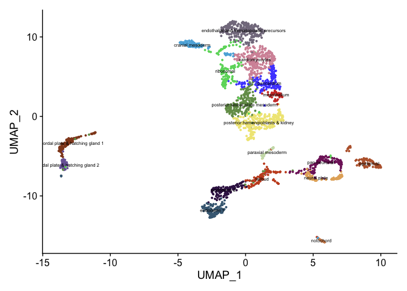

Process hand2 bud stage scRNA-seq R Notebook
================

``` r
library(Seurat)
library(sctransform)
library(ggplot2)
library(dplyr)
library(ggsci)
library(cowplot)
library(patchwork)
options(future.globals.maxSize = 4000 * 1024^2)
```

``` r
mypal <- pal_ucscgb(palette = "default",alpha = 1)(25)
cbpal18 <- c("#68023F","#008169","#EF0096","#00DCB5","#FFCFE2",
           "#003C86","#9400E6","#009FFA","#FF71FD","#7CFFFA",
           "#6A0213","#008607","#F60239","#00E307","#FFDC3D","#ffea8a","#001310","#ffe9f1")
```

``` r
GetQCplots <- function(seurat, mitoPattern){
  seurat[["percent.mt"]] <- PercentageFeatureSet(seurat, pattern = mitoPattern)
  v <- VlnPlot(seurat, features = c("nFeature_RNA", "nCount_RNA", "percent.mt"), ncol = 3)
  f1 <- FeatureScatter(seurat, feature1 = "nCount_RNA", feature2 = "percent.mt")
  f2 <- FeatureScatter(seurat, feature1 = "nFeature_RNA", feature2 = "percent.mt")
  f3 <- FeatureScatter(seurat, feature1 = "nCount_RNA", feature2 = "nFeature_RNA")
  
  qc1 <- ggplot(seurat@meta.data, aes(x=nCount_RNA, y=nFeature_RNA, color=percent.mt)) + geom_point(size=0.1) +
    scale_color_gradient(low="blue",high="red") + theme_classic()

  qc2 <- ggplot(seurat@meta.data, aes(x=nCount_RNA, y=percent.mt)) + geom_point(size=0.1) + scale_x_log10() +
    geom_density2d()

  qc3 <- ggplot(seurat@meta.data, aes(x=nCount_RNA, y=nFeature_RNA ,color=percent.mt)) + geom_point(size=0.1) +
    scale_x_log10() + scale_y_log10() + geom_density2d() +
    scale_color_gradient(low="gray",high="darkblue") + theme_classic()

  print(v)
  print(f1)
  print(f2)
  print(f3)
  print(qc1)
  print(qc2)
  print(qc3)

  return(seurat)
}
```

# Load data

``` r
seurat_data <- Read10X(data.dir = "~/Documents/Projects/Mosimann/Mosimann_scRNAseq/data/budstage_drlmCherry_hand2GFP/")
seurat <- CreateSeuratObject(seurat_data, project = "hand2_bud")
```

# QC data

``` r
seurat <- GetQCplots(seurat, "^mt-")
```

<!-- --><!-- --><!-- --><!-- --><!-- --><!-- -->

    ## Warning: The following aesthetics were dropped during statistical transformation: colour
    ## ℹ This can happen when ggplot fails to infer the correct grouping structure in
    ##   the data.
    ## ℹ Did you forget to specify a `group` aesthetic or to convert a numerical
    ##   variable into a factor?

<!-- -->

``` r
seurat <- subset(seurat, 
               subset = nFeature_RNA > 1500
               & percent.mt < 5)
seurat
```

# Normalization

``` r
seurat <- NormalizeData(seurat, verbose = F)
seurat <- FindVariableFeatures(seurat, nfeatures = 2000, selection.method = "vst", verbose = F)
all.genes <- rownames(seurat)
seurat <- ScaleData(seurat, features = all.genes, verbose = F)
```

# Perform Dimensionality

``` r
DefaultAssay(seurat) <- "RNA"
seurat <- RunPCA(seurat, verbose = F, npcs = 50)
ElbowPlot(seurat, ndims = 50)
```

<!-- -->

``` r
seurat <- RunUMAP(seurat, dims = 1:20, verbose = F)
seurat <- FindNeighbors(seurat, verbose = F, dims = 1:20)
```

``` r
seurat <- FindClusters(seurat, resolution = 0.8, verbose = F)
```

``` r
DimPlot(seurat, label = T, repel = T) + scale_color_igv() + ggtitle("res 0.8")
```

<!-- -->

``` r
Idents(seurat) <- "RNA_snn_res.0.8"
seurat <- RenameIdents(seurat,
                       "0" = "posterior hemangioblasts & kidney",
                       "1" = "endothalial and hematopoietic precursors",
                       "2" = "cardiomyocytes",
                       "3" = "posterior lateral plate mesoderm",
                       "4" = "mesothelium",
                       "5" = "pan-neuronal",
                       "6" = "ribosomal",
                       "7" = "endoderm 1",
                       "8" = "endoderm 2",
                       "9" = "prechordal plate & hatching gland 1",
                       "10" = "epidermal",
                       "11" = "tailbud",
                       "12" = "cranial mesoderm",
                       "13" = "neural plate",
                       "14" = "prechordal plate & hatching gland 2",
                       "15" = "paraxial mesoderm",
                       "16" = "notochord")
seurat$Clusters <- Idents(seurat)
DimPlot(seurat, label = T, label.size = 3) + NoLegend() + scale_color_igv()
```

<!-- -->

``` r
seurat <- FindSubCluster(seurat, cluster = "mesothelium", graph.name = "RNA_snn", resolution = 0.2)
```

    ## Modularity Optimizer version 1.3.0 by Ludo Waltman and Nees Jan van Eck
    ## 
    ## Number of nodes: 206
    ## Number of edges: 4986
    ## 
    ## Running Louvain algorithm...
    ## Maximum modularity in 10 random starts: 0.8099
    ## Number of communities: 2
    ## Elapsed time: 0 seconds

``` r
DimPlot(seurat, group.by = "sub.cluster", label = T, label.size = 2) + NoLegend() + scale_color_igv()
```

<!-- -->

``` r
Idents(seurat) <- "sub.cluster"
seurat <- RenameIdents(seurat,
                       "mesothelium_0" = "pericardium",
                       "mesothelium_1" = "mesothelium")
seurat$sub.cluster <- Idents(seurat)
DimPlot(seurat, label = T, label.size = 2) + NoLegend() + scale_color_igv()
```

<!-- -->

``` r
if (!dir.exists("RDSfiles")){
  dir.create("RDSfiles")
}
saveRDS(seurat, file = "RDSfiles/hand2.bud.clustered.RDS")
```

``` r
sessionInfo()
```

    ## R version 4.2.3 (2023-03-15)
    ## Platform: aarch64-apple-darwin20 (64-bit)
    ## Running under: macOS Monterey 12.6.2
    ## 
    ## Matrix products: default
    ## BLAS:   /Library/Frameworks/R.framework/Versions/4.2-arm64/Resources/lib/libRblas.0.dylib
    ## LAPACK: /Library/Frameworks/R.framework/Versions/4.2-arm64/Resources/lib/libRlapack.dylib
    ## 
    ## locale:
    ## [1] en_US.UTF-8/en_US.UTF-8/en_US.UTF-8/C/en_US.UTF-8/en_US.UTF-8
    ## 
    ## attached base packages:
    ## [1] stats     graphics  grDevices utils     datasets  methods   base     
    ## 
    ## other attached packages:
    ## [1] patchwork_1.1.2    cowplot_1.1.1      ggsci_3.0.0        dplyr_1.1.2       
    ## [5] ggplot2_3.4.2      sctransform_0.3.5  SeuratObject_4.1.3 Seurat_4.3.0.1    
    ## 
    ## loaded via a namespace (and not attached):
    ##   [1] ggbeeswarm_0.7.2       Rtsne_0.16             colorspace_2.1-0      
    ##   [4] deldir_1.0-6           ellipsis_0.3.2         ggridges_0.5.4        
    ##   [7] rstudioapi_0.14        spatstat.data_3.0-1    farver_2.1.1          
    ##  [10] leiden_0.4.3           listenv_0.9.0          ggrepel_0.9.3         
    ##  [13] fansi_1.0.4            R.methodsS3_1.8.2      codetools_0.2-19      
    ##  [16] splines_4.2.3          knitr_1.42             polyclip_1.10-4       
    ##  [19] jsonlite_1.8.4         ica_1.0-3              cluster_2.1.4         
    ##  [22] R.oo_1.25.0            png_0.1-8              uwot_0.1.14           
    ##  [25] shiny_1.7.4            spatstat.sparse_3.0-1  compiler_4.2.3        
    ##  [28] httr_1.4.6             Matrix_1.6-1.1         fastmap_1.1.1         
    ##  [31] lazyeval_0.2.2         cli_3.6.1              later_1.3.1           
    ##  [34] htmltools_0.5.5        tools_4.2.3            igraph_1.4.2          
    ##  [37] gtable_0.3.3           glue_1.6.2             RANN_2.6.1            
    ##  [40] reshape2_1.4.4         Rcpp_1.0.10            scattermore_1.0       
    ##  [43] vctrs_0.6.2            spatstat.explore_3.1-0 nlme_3.1-162          
    ##  [46] progressr_0.13.0       lmtest_0.9-40          spatstat.random_3.1-4 
    ##  [49] xfun_0.39              stringr_1.5.0          globals_0.16.2        
    ##  [52] mime_0.12              miniUI_0.1.1.1         lifecycle_1.0.3       
    ##  [55] irlba_2.3.5.1          goftest_1.2-3          future_1.32.0         
    ##  [58] MASS_7.3-60            zoo_1.8-12             scales_1.2.1          
    ##  [61] promises_1.2.0.1       spatstat.utils_3.0-2   parallel_4.2.3        
    ##  [64] RColorBrewer_1.1-3     yaml_2.3.7             reticulate_1.28       
    ##  [67] pbapply_1.7-0          gridExtra_2.3          ggrastr_1.0.2         
    ##  [70] stringi_1.7.12         highr_0.10             rlang_1.1.1           
    ##  [73] pkgconfig_2.0.3        matrixStats_0.63.0     evaluate_0.21         
    ##  [76] lattice_0.21-8         ROCR_1.0-11            purrr_1.0.1           
    ##  [79] tensor_1.5             labeling_0.4.2         htmlwidgets_1.6.2     
    ##  [82] tidyselect_1.2.0       parallelly_1.35.0      RcppAnnoy_0.0.20      
    ##  [85] plyr_1.8.8             magrittr_2.0.3         R6_2.5.1              
    ##  [88] generics_0.1.3         pillar_1.9.0           withr_2.5.0           
    ##  [91] fitdistrplus_1.1-11    survival_3.5-5         abind_1.4-5           
    ##  [94] sp_1.6-0               tibble_3.2.1           future.apply_1.10.0   
    ##  [97] KernSmooth_2.23-21     utf8_1.2.3             spatstat.geom_3.1-0   
    ## [100] plotly_4.10.1          rmarkdown_2.21         isoband_0.2.7         
    ## [103] grid_4.2.3             data.table_1.14.8      digest_0.6.31         
    ## [106] xtable_1.8-4           tidyr_1.3.0            httpuv_1.6.9          
    ## [109] R.utils_2.12.2         munsell_0.5.0          beeswarm_0.4.0        
    ## [112] viridisLite_0.4.2      vipor_0.4.5
