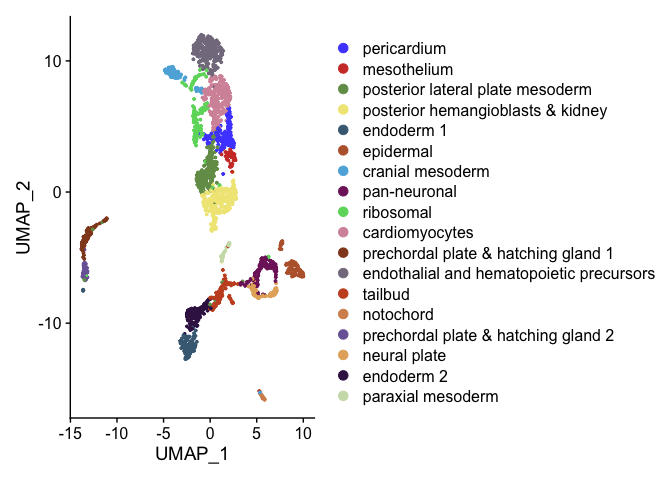
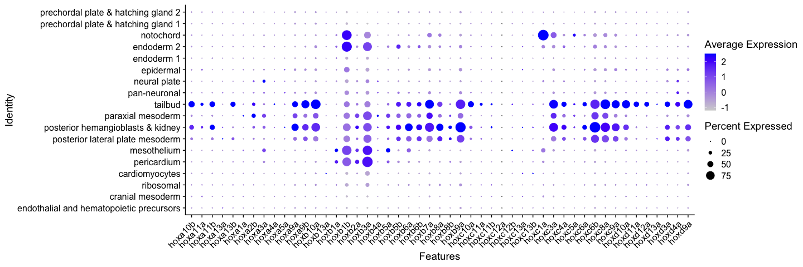
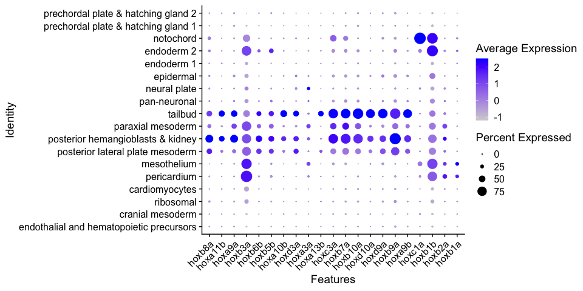
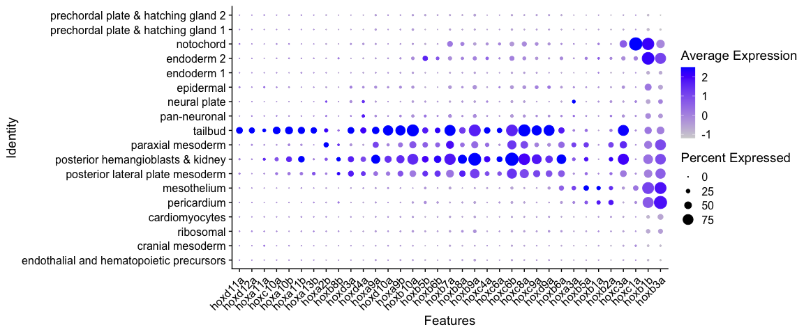
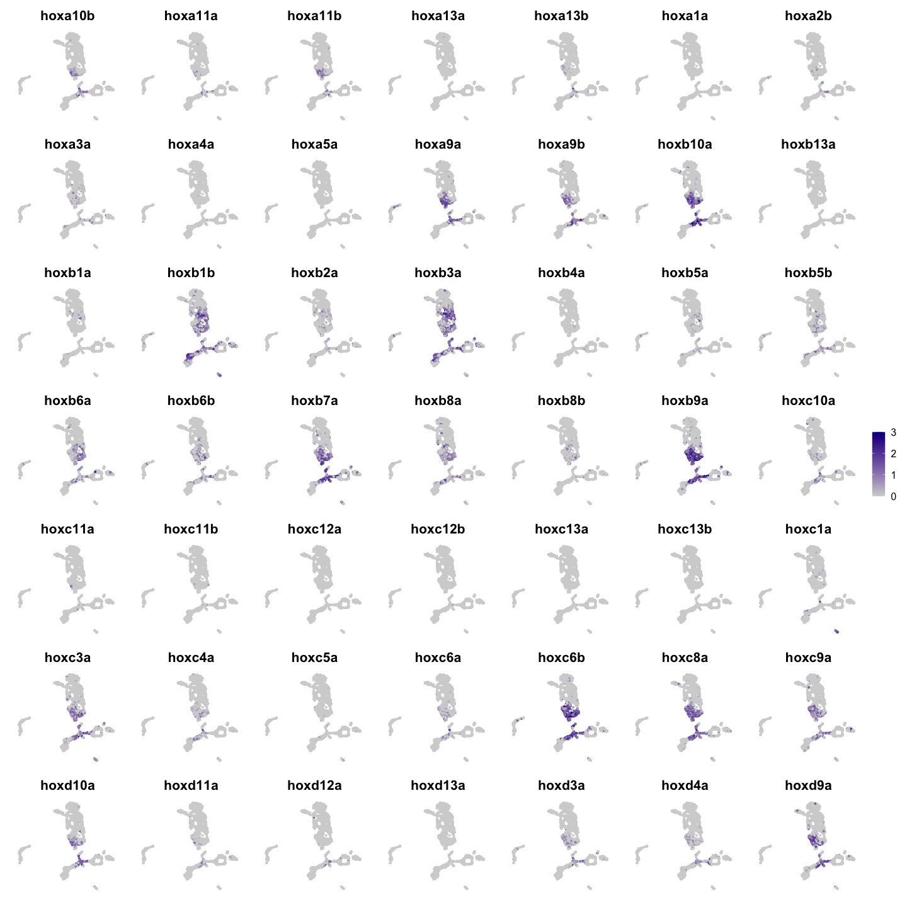
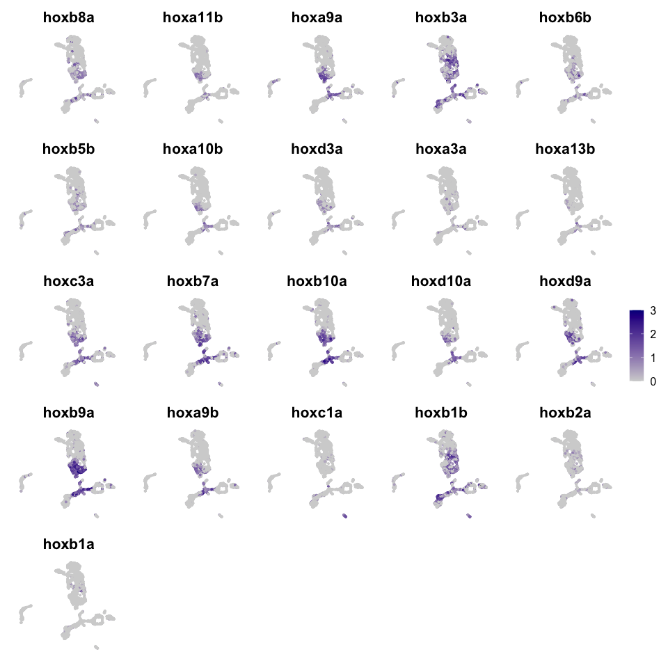
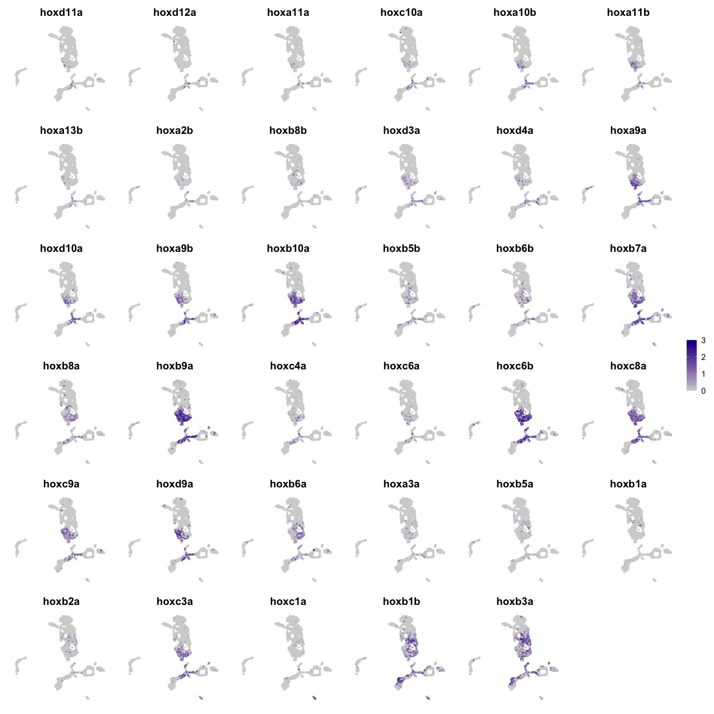

hox genes plots R Notebook
================

``` r
library(Seurat)
library(ggplot2)
library(dplyr)
library(ggsci)
library(openxlsx)
library(scCustomize)
options(future.globals.maxSize = 4000 * 1024^2)
```

# read data

``` r
seurat <- readRDS(file = "RDSfiles/hand2.bud.clustered.RDS")
Idents(seurat) <- "sub.cluster"
p <- DimPlot(seurat) + scale_color_igv()
p
```

<!-- -->

``` r
levels(seurat) <- c("endothalial and hematopoietic precursors",
                    "cranial mesoderm","ribosomal","cardiomyocytes","pericardium",
                    "mesothelium","posterior lateral plate mesoderm",
                    "posterior hemangioblasts & kidney","paraxial mesoderm",
                    "tailbud","pan-neuronal","neural plate","epidermal","endoderm 1",
                    "endoderm 2","notochord","prechordal plate & hatching gland 1",
                    "prechordal plate & hatching gland 2")
```

# hox genes plots

``` r
hoxgenes <- c("hoxa10b","hoxa11a","hoxa11b","hoxa13a","hoxa13b","hoxa1a","hoxa2b","hoxa3a",
              "hoxa4a","hoxa5a","hoxa9a","hoxa9b","hoxb10a","hoxb13a","hoxb1a","hoxb1b",
              "hoxb2a","hoxb3a","hoxb4a","hoxb5a","hoxb5b","hoxb6a","hoxb6b","hoxb7a",
              "hoxb8a","hoxb8b","hoxb9a","hoxc10a","hoxc11a","hoxc11b","hoxc12a","hoxc12b",
              "hoxc13a","hoxc13b","hoxc1a","hoxc3a","hoxc4a","hoxc5a","hoxc6a","hoxc6b",
              "hoxc8a","hoxc9a","hoxd10a","hoxd11a","hoxd12a","hoxd13a","hoxd3a","hoxd4a",
              "hoxd9a")
```

``` r
pdot <- DotPlot(seurat, features = hoxgenes) + RotatedAxis()
pdot
```

<!-- -->

``` r
ggsave(filename = "results/hox_dotplot_vs1.png", plot = pdot, width = 15, height = 5)
```

``` r
hoxgenes2 <- c("hoxb8a","hoxa11b","hoxa9a","hoxb3a","hoxb6b","hoxb5b","hoxa10b","hoxd3a",
              "hoxa3a","hoxa13b","hoxc3a","hoxb7a","hoxb10a","hoxd10a","hoxd9a","hoxb9a",
              "hoxa9b","hoxc1a","hoxb1b","hoxb2a","hoxb1a")
```

``` r
pdot2 <- DotPlot(seurat, features = hoxgenes2) + RotatedAxis()
pdot2
```

<!-- -->

``` r
ggsave(filename = "results/hox_dotplot_vs2.png", plot = pdot2, width = 10, height = 5)
```

``` r
hoxgenes3 <- c("hoxd11a","hoxd12a","hoxa11a","hoxc10a","hoxa10b","hoxa11b","hoxa13b",
               "hoxa2b","hoxb8b","hoxd3a","hoxd4a",
              "hoxa9a","hoxd10a","hoxa9b","hoxb10a","hoxb5b","hoxb6b","hoxb7a",
              "hoxb8a","hoxb9a","hoxc4a","hoxc6a","hoxc6b",
              "hoxc8a","hoxc9a",
              "hoxd9a","hoxb6a","hoxa3a","hoxb5a","hoxb1a","hoxb2a","hoxc3a","hoxc1a","hoxb1b","hoxb3a")
```

``` r
pdot3 <- DotPlot(seurat, features = hoxgenes3) + RotatedAxis()
pdot3
```

<!-- -->

``` r
ggsave(filename = "results/hox_dotplot_vs3.png", plot = pdot3, width = 12, height = 5)
```

``` r
fix.sc <- scale_color_gradientn(colors = c('lightgrey','darkblue'), limits = c(0,3))

fplot <- FeaturePlot(seurat, features = hoxgenes, combine = F, label.size = 3)
```

    ## Warning in FeaturePlot(seurat, features = hoxgenes, combine = F, label.size =
    ## 3): All cells have the same value (0) of hoxc12a.

``` r
fplota <- patchwork::wrap_plots(lapply(fplot, function (x) x + fix.sc + NoAxes()), guides = "collect")
```

    ## Scale for colour is already present.
    ## Adding another scale for colour, which will replace the existing scale.
    ## Scale for colour is already present.
    ## Adding another scale for colour, which will replace the existing scale.
    ## Scale for colour is already present.
    ## Adding another scale for colour, which will replace the existing scale.
    ## Scale for colour is already present.
    ## Adding another scale for colour, which will replace the existing scale.
    ## Scale for colour is already present.
    ## Adding another scale for colour, which will replace the existing scale.
    ## Scale for colour is already present.
    ## Adding another scale for colour, which will replace the existing scale.
    ## Scale for colour is already present.
    ## Adding another scale for colour, which will replace the existing scale.
    ## Scale for colour is already present.
    ## Adding another scale for colour, which will replace the existing scale.
    ## Scale for colour is already present.
    ## Adding another scale for colour, which will replace the existing scale.
    ## Scale for colour is already present.
    ## Adding another scale for colour, which will replace the existing scale.
    ## Scale for colour is already present.
    ## Adding another scale for colour, which will replace the existing scale.
    ## Scale for colour is already present.
    ## Adding another scale for colour, which will replace the existing scale.
    ## Scale for colour is already present.
    ## Adding another scale for colour, which will replace the existing scale.
    ## Scale for colour is already present.
    ## Adding another scale for colour, which will replace the existing scale.
    ## Scale for colour is already present.
    ## Adding another scale for colour, which will replace the existing scale.
    ## Scale for colour is already present.
    ## Adding another scale for colour, which will replace the existing scale.
    ## Scale for colour is already present.
    ## Adding another scale for colour, which will replace the existing scale.
    ## Scale for colour is already present.
    ## Adding another scale for colour, which will replace the existing scale.
    ## Scale for colour is already present.
    ## Adding another scale for colour, which will replace the existing scale.
    ## Scale for colour is already present.
    ## Adding another scale for colour, which will replace the existing scale.
    ## Scale for colour is already present.
    ## Adding another scale for colour, which will replace the existing scale.
    ## Scale for colour is already present.
    ## Adding another scale for colour, which will replace the existing scale.
    ## Scale for colour is already present.
    ## Adding another scale for colour, which will replace the existing scale.
    ## Scale for colour is already present.
    ## Adding another scale for colour, which will replace the existing scale.
    ## Scale for colour is already present.
    ## Adding another scale for colour, which will replace the existing scale.
    ## Scale for colour is already present.
    ## Adding another scale for colour, which will replace the existing scale.
    ## Scale for colour is already present.
    ## Adding another scale for colour, which will replace the existing scale.
    ## Scale for colour is already present.
    ## Adding another scale for colour, which will replace the existing scale.
    ## Scale for colour is already present.
    ## Adding another scale for colour, which will replace the existing scale.
    ## Scale for colour is already present.
    ## Adding another scale for colour, which will replace the existing scale.
    ## Scale for colour is already present.
    ## Adding another scale for colour, which will replace the existing scale.
    ## Scale for colour is already present.
    ## Adding another scale for colour, which will replace the existing scale.
    ## Scale for colour is already present.
    ## Adding another scale for colour, which will replace the existing scale.
    ## Scale for colour is already present.
    ## Adding another scale for colour, which will replace the existing scale.
    ## Scale for colour is already present.
    ## Adding another scale for colour, which will replace the existing scale.
    ## Scale for colour is already present.
    ## Adding another scale for colour, which will replace the existing scale.
    ## Scale for colour is already present.
    ## Adding another scale for colour, which will replace the existing scale.
    ## Scale for colour is already present.
    ## Adding another scale for colour, which will replace the existing scale.
    ## Scale for colour is already present.
    ## Adding another scale for colour, which will replace the existing scale.
    ## Scale for colour is already present.
    ## Adding another scale for colour, which will replace the existing scale.
    ## Scale for colour is already present.
    ## Adding another scale for colour, which will replace the existing scale.
    ## Scale for colour is already present.
    ## Adding another scale for colour, which will replace the existing scale.
    ## Scale for colour is already present.
    ## Adding another scale for colour, which will replace the existing scale.
    ## Scale for colour is already present.
    ## Adding another scale for colour, which will replace the existing scale.
    ## Scale for colour is already present.
    ## Adding another scale for colour, which will replace the existing scale.
    ## Scale for colour is already present.
    ## Adding another scale for colour, which will replace the existing scale.
    ## Scale for colour is already present.
    ## Adding another scale for colour, which will replace the existing scale.
    ## Scale for colour is already present.
    ## Adding another scale for colour, which will replace the existing scale.
    ## Scale for colour is already present.
    ## Adding another scale for colour, which will replace the existing scale.

``` r
fplota
```

<!-- -->

``` r
ggsave(filename = "results/hox_gene_feature_vs1.png", plot = fplota, width = 15, height = 15)
```

``` r
fplot2 <- FeaturePlot(seurat, features = hoxgenes2, combine = F, label.size = 2)
fplot2a <- patchwork::wrap_plots(lapply(fplot2, function (x) x + fix.sc + NoAxes()), guides = "collect")
```

    ## Scale for colour is already present.
    ## Adding another scale for colour, which will replace the existing scale.
    ## Scale for colour is already present.
    ## Adding another scale for colour, which will replace the existing scale.
    ## Scale for colour is already present.
    ## Adding another scale for colour, which will replace the existing scale.
    ## Scale for colour is already present.
    ## Adding another scale for colour, which will replace the existing scale.
    ## Scale for colour is already present.
    ## Adding another scale for colour, which will replace the existing scale.
    ## Scale for colour is already present.
    ## Adding another scale for colour, which will replace the existing scale.
    ## Scale for colour is already present.
    ## Adding another scale for colour, which will replace the existing scale.
    ## Scale for colour is already present.
    ## Adding another scale for colour, which will replace the existing scale.
    ## Scale for colour is already present.
    ## Adding another scale for colour, which will replace the existing scale.
    ## Scale for colour is already present.
    ## Adding another scale for colour, which will replace the existing scale.
    ## Scale for colour is already present.
    ## Adding another scale for colour, which will replace the existing scale.
    ## Scale for colour is already present.
    ## Adding another scale for colour, which will replace the existing scale.
    ## Scale for colour is already present.
    ## Adding another scale for colour, which will replace the existing scale.
    ## Scale for colour is already present.
    ## Adding another scale for colour, which will replace the existing scale.
    ## Scale for colour is already present.
    ## Adding another scale for colour, which will replace the existing scale.
    ## Scale for colour is already present.
    ## Adding another scale for colour, which will replace the existing scale.
    ## Scale for colour is already present.
    ## Adding another scale for colour, which will replace the existing scale.
    ## Scale for colour is already present.
    ## Adding another scale for colour, which will replace the existing scale.
    ## Scale for colour is already present.
    ## Adding another scale for colour, which will replace the existing scale.
    ## Scale for colour is already present.
    ## Adding another scale for colour, which will replace the existing scale.
    ## Scale for colour is already present.
    ## Adding another scale for colour, which will replace the existing scale.

``` r
fplot2a
```

<!-- -->

``` r
ggsave(filename = "results/hox_gene_feature_vs2.png", plot = fplot2a, width = 10, height = 10)
```

``` r
fplot3 <- FeaturePlot(seurat, features = hoxgenes3, combine = F, label.size = 2)
fplot3a <- patchwork::wrap_plots(lapply(fplot3, function (x) x + fix.sc + NoAxes()), guides = "collect")
```

    ## Scale for colour is already present.
    ## Adding another scale for colour, which will replace the existing scale.
    ## Scale for colour is already present.
    ## Adding another scale for colour, which will replace the existing scale.
    ## Scale for colour is already present.
    ## Adding another scale for colour, which will replace the existing scale.
    ## Scale for colour is already present.
    ## Adding another scale for colour, which will replace the existing scale.
    ## Scale for colour is already present.
    ## Adding another scale for colour, which will replace the existing scale.
    ## Scale for colour is already present.
    ## Adding another scale for colour, which will replace the existing scale.
    ## Scale for colour is already present.
    ## Adding another scale for colour, which will replace the existing scale.
    ## Scale for colour is already present.
    ## Adding another scale for colour, which will replace the existing scale.
    ## Scale for colour is already present.
    ## Adding another scale for colour, which will replace the existing scale.
    ## Scale for colour is already present.
    ## Adding another scale for colour, which will replace the existing scale.
    ## Scale for colour is already present.
    ## Adding another scale for colour, which will replace the existing scale.
    ## Scale for colour is already present.
    ## Adding another scale for colour, which will replace the existing scale.
    ## Scale for colour is already present.
    ## Adding another scale for colour, which will replace the existing scale.
    ## Scale for colour is already present.
    ## Adding another scale for colour, which will replace the existing scale.
    ## Scale for colour is already present.
    ## Adding another scale for colour, which will replace the existing scale.
    ## Scale for colour is already present.
    ## Adding another scale for colour, which will replace the existing scale.
    ## Scale for colour is already present.
    ## Adding another scale for colour, which will replace the existing scale.
    ## Scale for colour is already present.
    ## Adding another scale for colour, which will replace the existing scale.
    ## Scale for colour is already present.
    ## Adding another scale for colour, which will replace the existing scale.
    ## Scale for colour is already present.
    ## Adding another scale for colour, which will replace the existing scale.
    ## Scale for colour is already present.
    ## Adding another scale for colour, which will replace the existing scale.
    ## Scale for colour is already present.
    ## Adding another scale for colour, which will replace the existing scale.
    ## Scale for colour is already present.
    ## Adding another scale for colour, which will replace the existing scale.
    ## Scale for colour is already present.
    ## Adding another scale for colour, which will replace the existing scale.
    ## Scale for colour is already present.
    ## Adding another scale for colour, which will replace the existing scale.
    ## Scale for colour is already present.
    ## Adding another scale for colour, which will replace the existing scale.
    ## Scale for colour is already present.
    ## Adding another scale for colour, which will replace the existing scale.
    ## Scale for colour is already present.
    ## Adding another scale for colour, which will replace the existing scale.
    ## Scale for colour is already present.
    ## Adding another scale for colour, which will replace the existing scale.
    ## Scale for colour is already present.
    ## Adding another scale for colour, which will replace the existing scale.
    ## Scale for colour is already present.
    ## Adding another scale for colour, which will replace the existing scale.
    ## Scale for colour is already present.
    ## Adding another scale for colour, which will replace the existing scale.
    ## Scale for colour is already present.
    ## Adding another scale for colour, which will replace the existing scale.
    ## Scale for colour is already present.
    ## Adding another scale for colour, which will replace the existing scale.
    ## Scale for colour is already present.
    ## Adding another scale for colour, which will replace the existing scale.

``` r
fplot3a
```

<!-- -->

``` r
ggsave(filename = "results/hox_gene_feature_vs3.png", plot = fplot3a, width = 15, height = 15)
```

``` r
sessionInfo()
```

    ## R version 4.2.3 (2023-03-15)
    ## Platform: aarch64-apple-darwin20 (64-bit)
    ## Running under: macOS Monterey 12.6.2
    ## 
    ## Matrix products: default
    ## BLAS:   /Library/Frameworks/R.framework/Versions/4.2-arm64/Resources/lib/libRblas.0.dylib
    ## LAPACK: /Library/Frameworks/R.framework/Versions/4.2-arm64/Resources/lib/libRlapack.dylib
    ## 
    ## locale:
    ## [1] en_US.UTF-8/en_US.UTF-8/en_US.UTF-8/C/en_US.UTF-8/en_US.UTF-8
    ## 
    ## attached base packages:
    ## [1] stats     graphics  grDevices utils     datasets  methods   base     
    ## 
    ## other attached packages:
    ## [1] scCustomize_2.0.1  openxlsx_4.2.5.2   ggsci_3.0.0        dplyr_1.1.2       
    ## [5] ggplot2_3.4.2      SeuratObject_5.0.1 Seurat_4.3.0.1    
    ## 
    ## loaded via a namespace (and not attached):
    ##   [1] ggbeeswarm_0.7.2       Rtsne_0.16             colorspace_2.1-0      
    ##   [4] deldir_1.0-6           ellipsis_0.3.2         ggridges_0.5.4        
    ##   [7] snakecase_0.11.1       circlize_0.4.15        GlobalOptions_0.1.2   
    ##  [10] rstudioapi_0.14        spatstat.data_3.0-1    farver_2.1.1          
    ##  [13] leiden_0.4.3           listenv_0.9.0          ggrepel_0.9.3         
    ##  [16] lubridate_1.9.2        fansi_1.0.4            codetools_0.2-19      
    ##  [19] splines_4.2.3          knitr_1.42             polyclip_1.10-4       
    ##  [22] spam_2.9-1             jsonlite_1.8.4         ica_1.0-3             
    ##  [25] cluster_2.1.4          png_0.1-8              uwot_0.1.14           
    ##  [28] ggprism_1.0.4          shiny_1.7.4            sctransform_0.3.5     
    ##  [31] spatstat.sparse_3.0-1  compiler_4.2.3         httr_1.4.6            
    ##  [34] Matrix_1.6-5           fastmap_1.1.1          lazyeval_0.2.2        
    ##  [37] cli_3.6.1              later_1.3.1            htmltools_0.5.5       
    ##  [40] tools_4.2.3            igraph_1.4.2           dotCall64_1.0-2       
    ##  [43] gtable_0.3.3           glue_1.6.2             RANN_2.6.1            
    ##  [46] reshape2_1.4.4         Rcpp_1.0.10            scattermore_1.2       
    ##  [49] vctrs_0.6.2            spatstat.explore_3.1-0 nlme_3.1-162          
    ##  [52] progressr_0.13.0       lmtest_0.9-40          spatstat.random_3.1-4 
    ##  [55] xfun_0.39              stringr_1.5.0          globals_0.16.2        
    ##  [58] timechange_0.2.0       mime_0.12              miniUI_0.1.1.1        
    ##  [61] lifecycle_1.0.3        irlba_2.3.5.1          goftest_1.2-3         
    ##  [64] future_1.32.0          MASS_7.3-60            zoo_1.8-12            
    ##  [67] scales_1.2.1           ragg_1.2.5             promises_1.2.0.1      
    ##  [70] spatstat.utils_3.0-2   parallel_4.2.3         rematch2_2.1.2        
    ##  [73] RColorBrewer_1.1-3     yaml_2.3.7             reticulate_1.28       
    ##  [76] pbapply_1.7-0          gridExtra_2.3          ggrastr_1.0.2         
    ##  [79] stringi_1.7.12         highr_0.10             paletteer_1.5.0       
    ##  [82] zip_2.3.0              shape_1.4.6            systemfonts_1.0.4     
    ##  [85] rlang_1.1.1            pkgconfig_2.0.3        matrixStats_0.63.0    
    ##  [88] evaluate_0.21          lattice_0.21-8         ROCR_1.0-11           
    ##  [91] purrr_1.0.1            tensor_1.5             labeling_0.4.2        
    ##  [94] patchwork_1.1.2        htmlwidgets_1.6.2      cowplot_1.1.1         
    ##  [97] tidyselect_1.2.0       parallelly_1.35.0      RcppAnnoy_0.0.20      
    ## [100] plyr_1.8.8             magrittr_2.0.3         R6_2.5.1              
    ## [103] generics_0.1.3         withr_2.5.0            pillar_1.9.0          
    ## [106] fitdistrplus_1.1-11    survival_3.5-5         abind_1.4-5           
    ## [109] sp_1.6-0               tibble_3.2.1           future.apply_1.10.0   
    ## [112] janitor_2.2.0          KernSmooth_2.23-21     utf8_1.2.3            
    ## [115] spatstat.geom_3.1-0    plotly_4.10.1          rmarkdown_2.21        
    ## [118] grid_4.2.3             data.table_1.14.8      forcats_1.0.0         
    ## [121] digest_0.6.31          xtable_1.8-4           tidyr_1.3.0           
    ## [124] httpuv_1.6.9           textshaping_0.3.6      munsell_0.5.0         
    ## [127] beeswarm_0.4.0         viridisLite_0.4.2      vipor_0.4.5
